<!-- 
#  -->
# NMDC EDGE Quick Start User Guide

## Setting Up

### Register for an account

1. Visit the homepage for NMDC EDGE platform by going to [https://nmdc-edge.org](https://nmdc-edge.org/home)

2. Click on "ORCiD LOGIN" to login to your account on the NMDC EDGE platform. 

3. Log in to ORCiD using your registered credentials. If you do not have an ORCiD, click on "Register Now" and follow the instructions to set-up an ORCiD account.

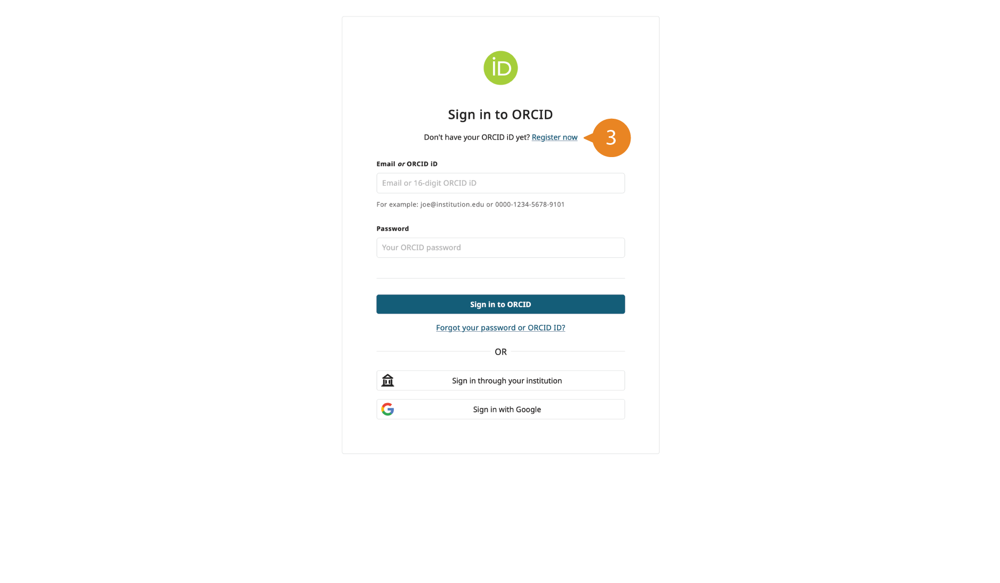

4. If you are logging in for the first time, click on "My Profile" and optionally provide your First Name, Last Name, and Email. The first grayed out box will already have your ORCiD. You can also set the "Project Status Notification" to ON (OFF by default). If ON, notifications about your workflow runs will be sent to the Email you provided. Click on "Save Changes"

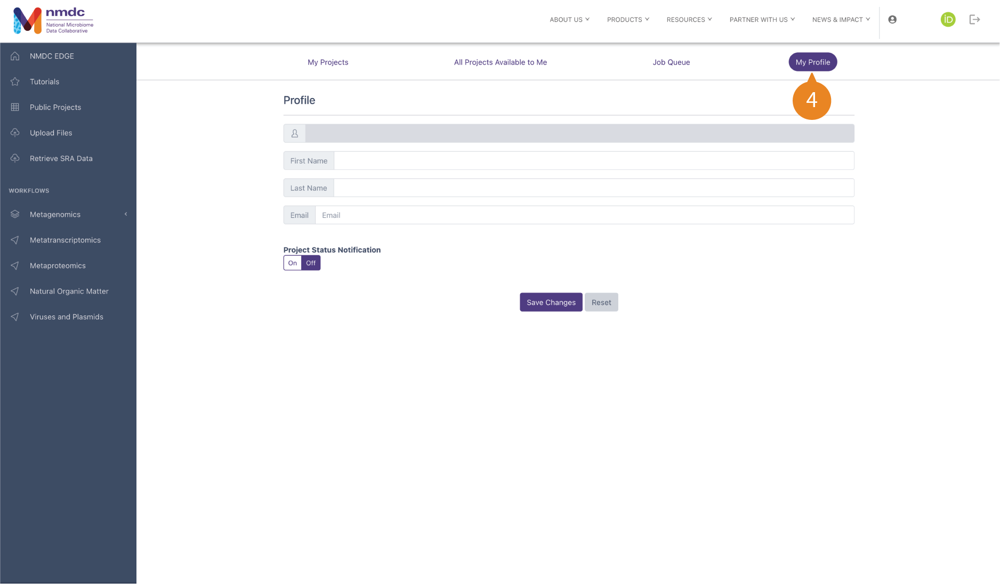

### Upload data

You can upload your own data to process through the workflows. Click on "Upload Files" in the left menu bar. This will open a window which allows you to drag and drop files or browse for your data files. If you do not have a dataset to test, you can download this metagenomic [test data](https://portal.nersc.gov/cfs/m3408/test_data/SRR7877884/SRR7877884-int-0.1.fastq.gz) and upload it to the NMDC EDGE platform. 

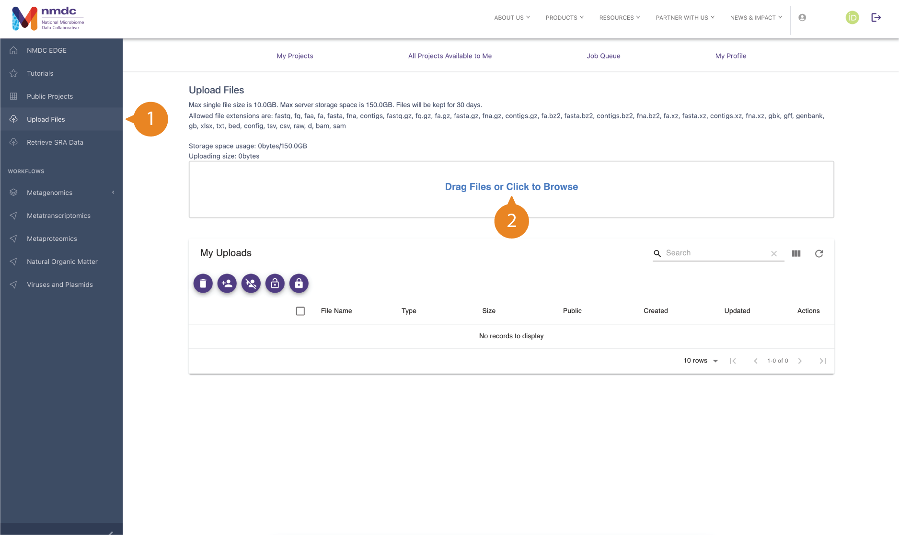

Additionally, there are some datasets in the Public Data folder for you to test within the NMDC EDGE platform.

Alternatively, you can select "Retrieve SRA Data" in the left menu bar and input NCBI SRA accession number(s) to pull data directly from SRA. 

##  Running the Workflows

One of the core end-to-end tools available to NMDC EDGE users is the Metagenomics workflow. It takes raw, short-read FASTQ files and runs the following workflows (linked to their respective GitHub repositories):

 - [ReadsQC](https://github.com/microbiomedata/ReadsQC) (reads quality control)
 - [Read-based Taxonomy](https://github.com/microbiomedata/ReadbasedAnalysis) (read-based taxonomic classification)
 - [MetaAssembly](https://github.com/microbiomedata/metaAssembly) (metagenome assembly)
 - [Virus and Plasmids](https://portal.nersc.gov/genomad/) (virus and plasmid genome identification)
 - [MG Annotation](https://github.com/microbiomedata/mg_annotation) (metagenome annotation)
 - [MetaMAGs](https://github.com/microbiomedata/metaMAGs) (binning of population genomes to generate metagenome-assembled genomes)

More information on these metagenomic workflows is available in the [workflow documentation](../../../../pullers/workflow_docs/metagenome_workflow_overview/docs/index.rst). 

A summary of the workflows and link to their documentation is available in [this table](#workflow-summaries).

### Running the full metagenomic workflow

In this example, we will run the interleaved FASTQ file for SRR7877884, which is available in the public data folder in NMDC EDGE file section options and [online](https://portal.nersc.gov/cfs/m3408/test_data/SRR7877884/SRR7877884-int.fastq.gz). Note that this is a larger file at 3.65 GB. A smaller option (10% subset of SRR7877884) is available at 367.25 MB both in the public data folder (as `SRR7877884-int-0.1.fastq.gz`) and online as a [URL](https://portal.nersc.gov/cfs/m3408/test_data/SRR7877884/SRR7877884-int-0.1.fastq.gz). To copy the file URLs, right click (CTRL+Left Click on Mac) and select "Copy Link".

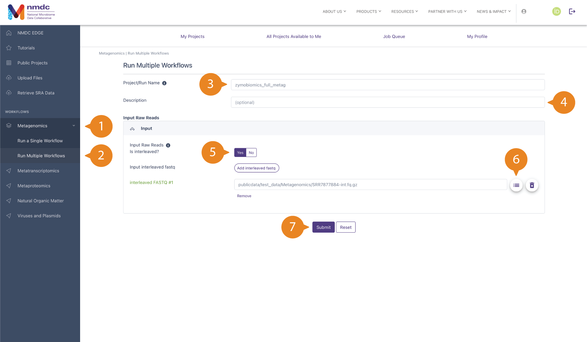

1. Click on the "Metagenomics" tab on the left vertical navigation bar. 
2. Select the "Run Multiple Workflows" option from the dropdown.
3.  Enter a **unique** Project/Run Name with no spaces (underscores are fine).
4.  A description (optional, but recommended).
5.  Select if the input data is interleaved (YES by default). If the data is paired select NO and it will allow you to upload both, forward and reverse files.
6.  Then select the input file(s). Clicking on the button to select "interleaved FASTQ #1" opens a box called "Select a file" (as shown in the image below) to allow the user to find the desired files, either from the public data folder, or files uploaded by the user. If the files are uploaded to an accessible URL, the URL can be pasted into the box.

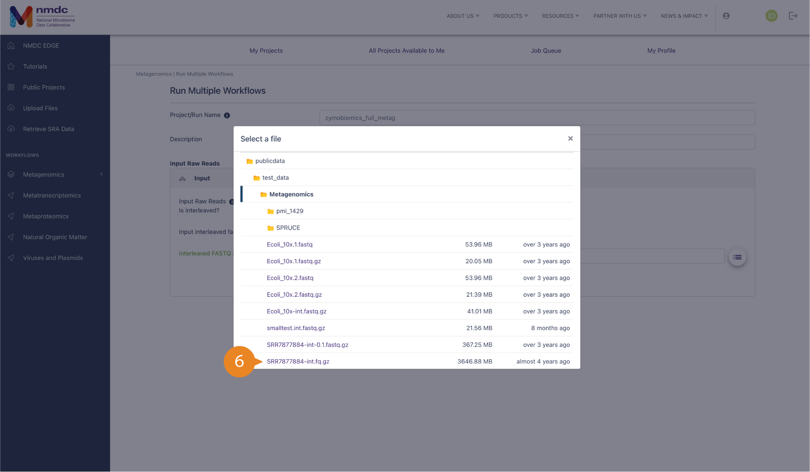
    
7.  Click "Submit" to start a metagenome workflow run.

### Running a single metagenomics workflow 

Each component of the end-to-end Metagenomics workflow can be run on its own, provided with the correct input types. The following are some examples for running these individual workflows.

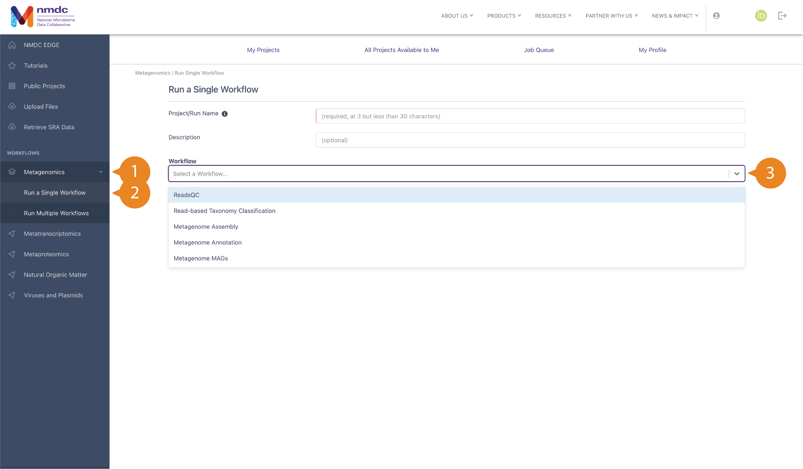

For example, to run a paired set of FASTQ files through ReadsQC, the user can perform the following steps:

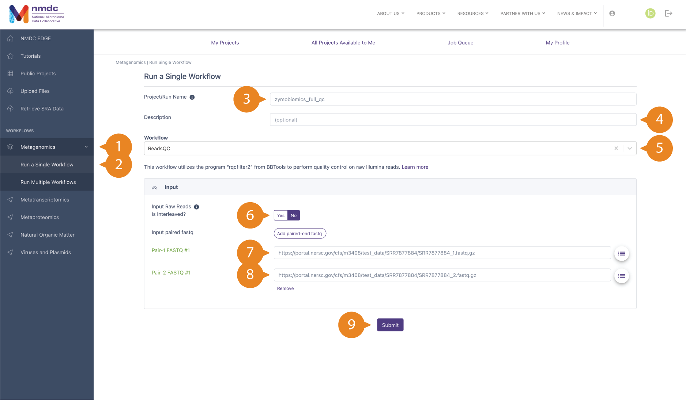

1. Click on the "Metagenomics" tab on the left vertical navigation bar. 
2. Select the "Run a Single Workflow" option from the dropdown.
3. A unique Project/Run Name with no spaces (underscores are fine).
4. A description (optional, but recommended).
5. The workflow desired from the drop-down menu.
6. Select if the input data is interleaved (YES by default). If the data is paired select NO and it will allow you to upload both forward and reverse files. 
7. Select the input file box and paste in the desired URL or choose a file from the button on the right. For this example, we will use [SRR7877884's R1](https://portal.nersc.gov/cfs/m3408/test_data/SRR7877884/SRR7877884_1.fastq.gz).
8. Paste the FASTQ URL for the associated R2 file ([SRR7877884's R2](https://portal.nersc.gov/cfs/m3408/test_data/SRR7877884/SRR7877884_2.fastq.gz)) or select a file using the file selection menu.
9. Click "Submit" to start a workflow run.

### Inputs

Some other options for inputs include multiple sets of FASTQ files in interleaved or paired form for samples that may want to be run together. One such example is as follows, with Step 7 being the button to allow for the multiple file selections.

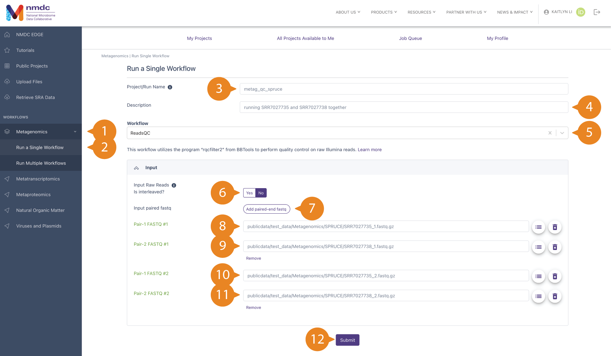 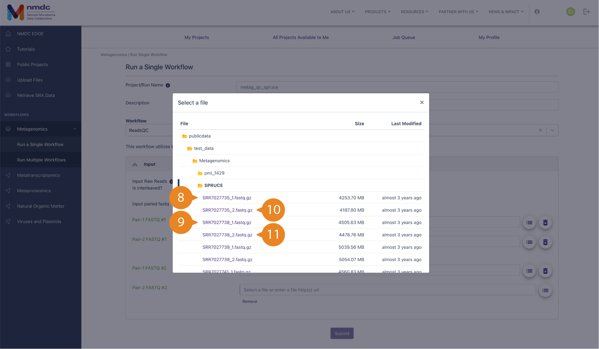

Other ways the inputs for each workflow may change include the types of files needed as well as the number of different types of files. For example, with Read Based Analysis, the input is a filtered FASTQ file. This can be uploaded by the user, input as a URL, or taken from the result of other workflows run on NMDC EDGE. The results of your other workflows will be available in the file selection menu if the file type is right for the workflow you need to run. For the Read-based Taxonomy Classification workflow, the input is filtered FASTQ files, which is the output of the ReadsQC workflow.

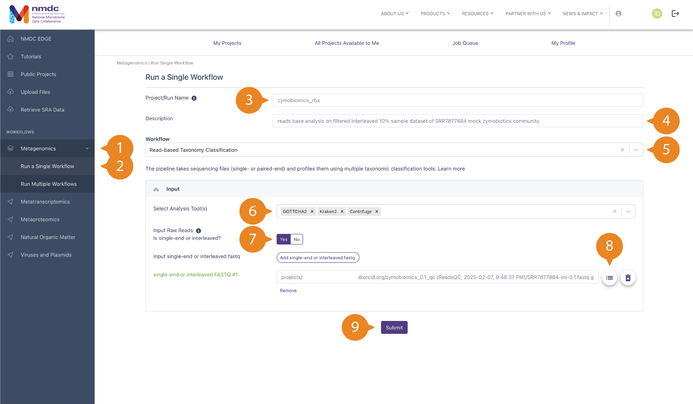 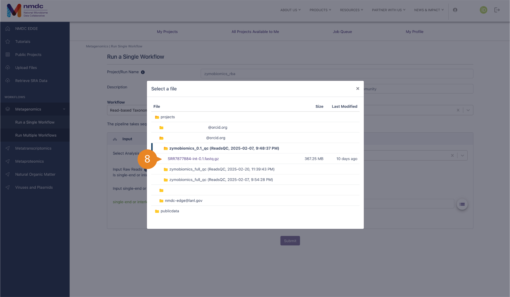

Each workflow submission page will list the types of files necessary. For further reading, please refer to the [individual workflow documentation](../../../../pullers/workflow_docs/index.rst) for a full list of inputs and outputs. 

### Output 

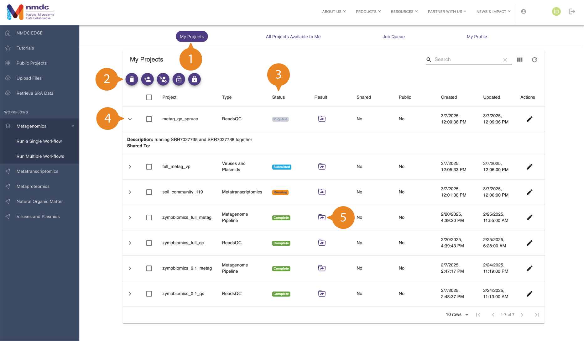

1. To view the status of projects and their outputs, navigate to the My Projects tab at the top of the page. 
2. Links (in the purple circles) are provided to share projects, make projects public, or delete projects
3. The "Status" column shows whether the job is in the queue (gray), submitted (blue), running (yellow), has failed (red) or completed (green). If a project fails, a log will give the error messages for troubleshooting.
4. For a quick summary on the specific project, click the dropdown arrow to the left of the project checkbox.
5. To view the full project results, click on the folder with the arrow under the "Result" column.

In this example, we will view the results of the end-to-end metagenomics run set up in the [Run Multiple Workflows](#running-the-full-metagenomic-workflow) section.

### Project Summary (Results)

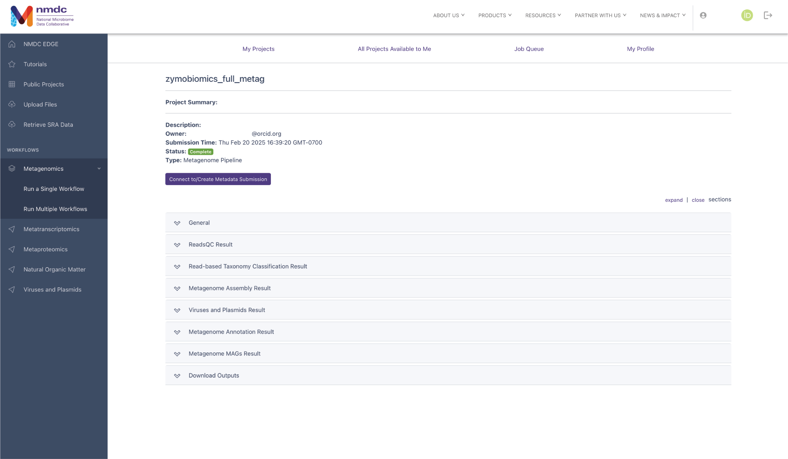

The project results page contains a quick summary of the workflow(s) run, a direct link for [Data Portal Submission](https://docs.microbiomedata.org/howto_guides/submit2nmdc), drop-down sections for a quick tabular/visual overview of results, and an area to download the output files. 

For a quick overview of every output type available for metagenomic analysis, we will be looking at the results of "Run Multiple Workflows".

#### General

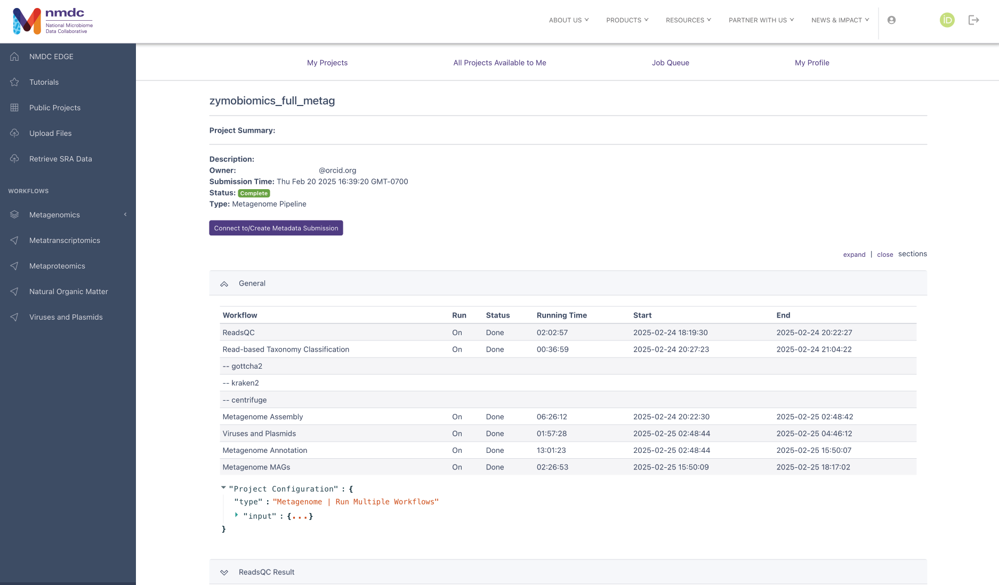

This example shows the results of a metagenome workflow run which shows run time under the General tab, the workflow results of each individual metagenome workflow, and the files available for download under the Download Outputs tab.

--------

--------

## Workflow Summaries 

Before diving into more detail on inputs and outputs for components of the Metagenome workflow, this table provides a summary of all workflows (linked to their documentation) to conclude the "quick-start" portion of this guide.

| Workflow                                                                                                                      | Summary                                                                   | Inputs                                                     | Outputs                                                                  | Available Downstream NMDC EDGE Analysis                          |
|-------------------------------------------------------------------------------------------------------------------------------|---------------------------------------------------------------------------|------------------------------------------------------------|--------------------------------------------------------------------------|------------------------------------------------------------------|
| [ReadsQC](https://docs.microbiomedata.org/workflows/chapters/3_Metagenome_Reads_QC/index.html )                               | Quality control on raw Illumina reads                                     | `.fastq`, `.fq`, `.fastq.gz`, `.fq.gz`                     | `fq.gz`                                                                  | Read-based Taxonomy, MetaAssembly                                |
| [Read-based Taxonomy](https://docs.microbiomedata.org/workflows/chapters/2_Read_Based_Taxonomy/index.html)                    | Taxonomic classification profiling of Illumina sequencing file reads      | (filtered) `.fastq`, `.fq`, `.fastq.gz`, `.fq.gz`          | `.tsv`, `.html`                                                          |                                                                  |
| [MetaAssembly](https://docs.microbiomedata.org/workflows/chapters/4_Metagenome_Assembly/index.html )                          | Error correction, contig assembly, and contig mapping                     | (filtered) `.fastq`, `.fq`, `.fastq.gz`, `.fq.gz`          | `.agp`, `.fna`, `.sam.gz`, `.bam`, `.json`                               | MG Annotation, Virus and Plasmids                                |
| [Virus and Plasmids](https://portal.nersc.gov/genomad/index.html)                                                             | Identifies virus and plasmid genomes from nucleotide sequences            |  `.fasta`, `.fa`, `.fna`                                   | `.tsv`, `.faa`, `.json`                                                  |                                                                  |
| [MG Annotation](https://docs.microbiomedata.org/workflows/chapters/5_Metagenome_and_Metatranscriptome_Annotation/index.html)  | Structural and functional annotation of assembled metagenomes             | `.fasta`, `.fa`, `.fna`, `.fasta.gz`, `.fa.gz`, `.fna.gz`  | `.html`, `.gff`, `.tsv`, `.fna`                                          | MetaMAGs                                                         |
| [MetaMAGs](https://docs.microbiomedata.org/workflows/chapters/6_Metagenome_Assembled_Genome/index.html)                       | Classifies contigs into bins and refines them using functional annotation | `.fasta`, `.fa`, `.fna`, `.sam.gz`, `.bam`,`.gff`          | `tar.gz` bins of `.html`, `.pdf`, `.txt`, `.tsv`, `.faa`, `.fna`, `.gff` |                                                                  |
| [Metagenomics](https://docs.microbiomedata.org/workflows/chapters/1_Metagenome_Workflow_Overview/index.html)                  | Standardized end-to-end metagenome workflow                               | `.fastq`, `.fq`, `.fastq.gz`, `.fq.gz`                     | All the above                                                            | Components can be submitted to: ReadsQC, Read-based Taxonomy, MetaAssembly, Virus and Plasmids, MG Annotation, MetaMAGs |
| [Metatranscriptomics](https://docs.microbiomedata.org/workflows/chapters/7_Metatranscriptome_Workflow_Overview/index.html)    | Standardized end-to-end metatranscriptome workflow                        | `.fastq`, `.fq`, `.fastq.gz`, `.fq.gz`                     | All the above                                                            | MG Annotation, Virus and Plasmids                                |
| [Metaproteomics](https://docs.microbiomedata.org/workflows/chapters/11_Metaproteomics/index.html)                             | End-to-end data processing pipeline for studying proteomes using LC-MS/MS | `RAW` MS/MS, `.fasta` `.faa` output of MG Annotation       | `.tsv`, `.txt`, `.fasta`, `.gff`                                         |                                                                  |
| [Natural Organic Matter](https://docs.microbiomedata.org/workflows/chapters/13_Natural_Organic_Matter/index.html)             | Signal processing and molecular formula assignment of DI FT-MS data       | mass list, `.tsv`, `.txt`                                  | `.csv`, `.rsv`, `.hdf`, `.xlsx`, `.json`                                 |                                                                  |

--------

--------

### Workflow Results

#### ReadsQC

This workflow performs quality control on raw Illumina reads to trim/filter low quality data and to remove artifacts, linkers, adapters, spike-in reads and reads mapping to several hosts and common microbial contaminants. If run on its own via the "Run Single Workflow" option, the results page would look as such:

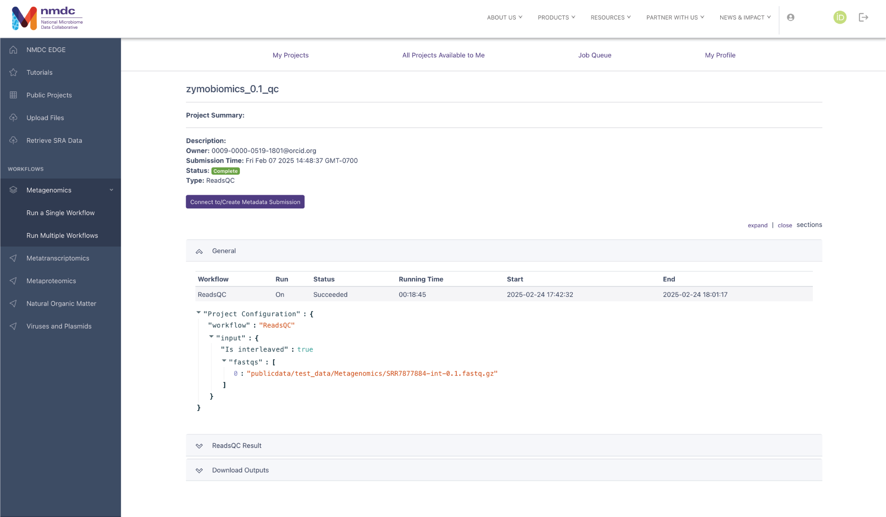

Regardless of whether the workflow was run on its own or as part of the larger Metagenomic pipeline, the outputs will be the same. 

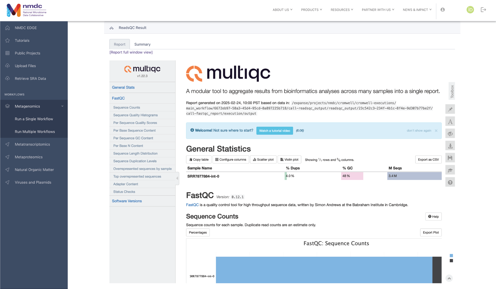 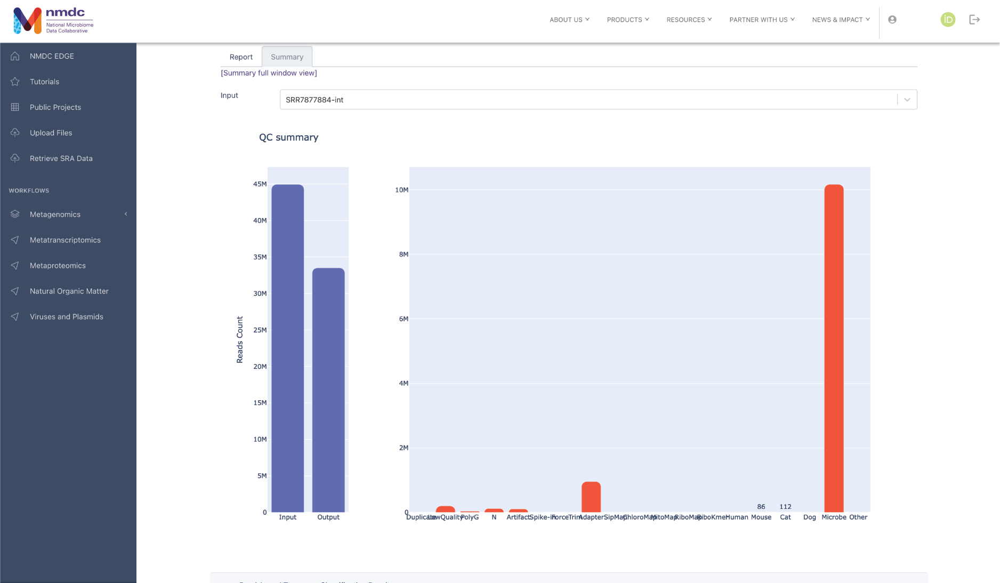 

The ReadsQC Result section provides a variety of metrics including the number of reads and bases before and after trimming and filtering. Both tabs of the Result section are allowed for larger viewing through the "Summary full window view" link. 

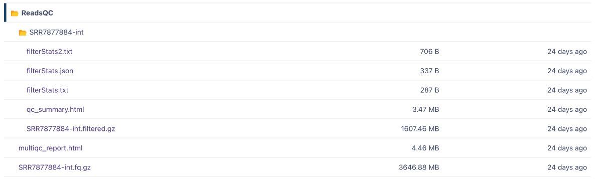

The Download Output section provides output files available to download. The clean data will be in an interleaved `.fq.gz` file. General QC statistics are in the `filterStats.txt` file.

#### Read-based Taxonomy Classification

This workflow takes in Illumina sequencing files (single-end or paired-end) and profiles the reads using multiple taxonomic classification tools. 

This workflow allows for the selection of three analysis tools: GOTTCHA2, Kraken2, and Centrifuge. All three are selected by default when running the full metagenomic pipeline, but can be changed when running as a stand-alone workflow (Step 6).

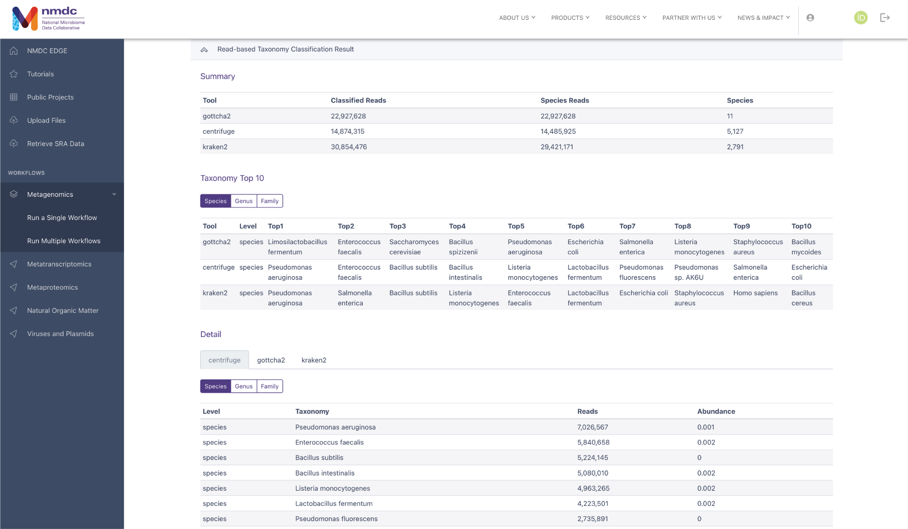 

The Read-based Taxonomy Classification Result section has a summary section at the top and results for each tool at three levels of taxonomy in the Taxonomy Top 10 section. The Detail section has classified reads results and relative abundance results for each tool at three levels of taxonomy.

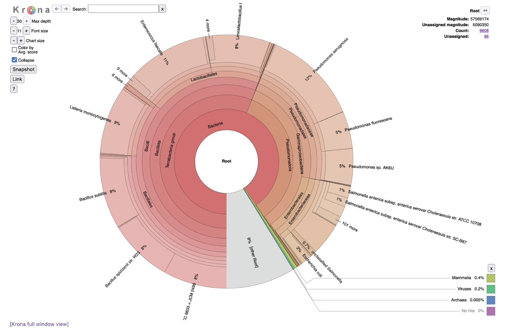 

The tables are followed by an interactive multilevel pie charts to visualize organisms and classifications. The Krona plots are generated for the results at each of the three taxonomic levels for each of the tools and these can also be found in the Detail section. 

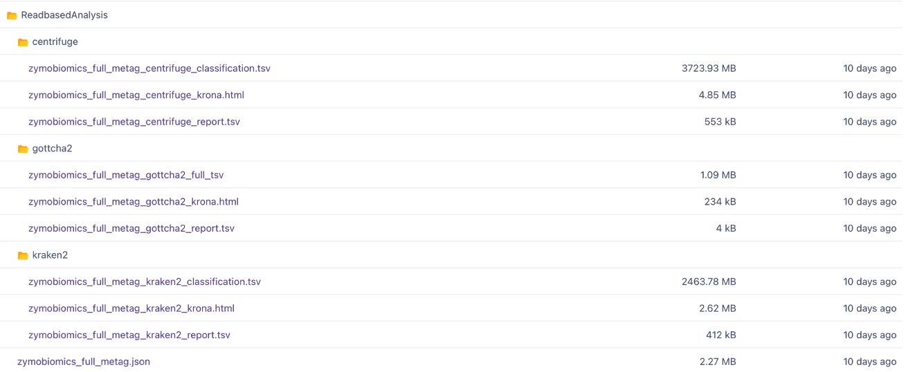

The Download Output section provides output files available to download. Each tool has a separate folder for the results from that tool. Full tabular results are in the largest `.tsv` file and the interactive Krona plots (`.html` files) open in a separate browser window.

#### Assembly

This workflow takes in paired-end Illumina reads and performs error correction. Then the corrected reads are assembled using metaSPAdes. After assembly, the reads are mapped back to the contigs for coverage information.

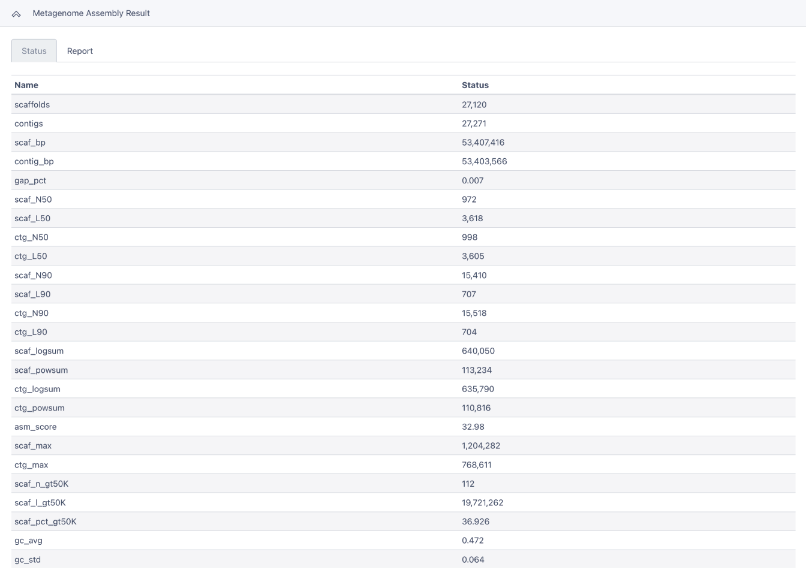
The Metagenome Assembly Result's Status tab contains summary statistics of the assembly.

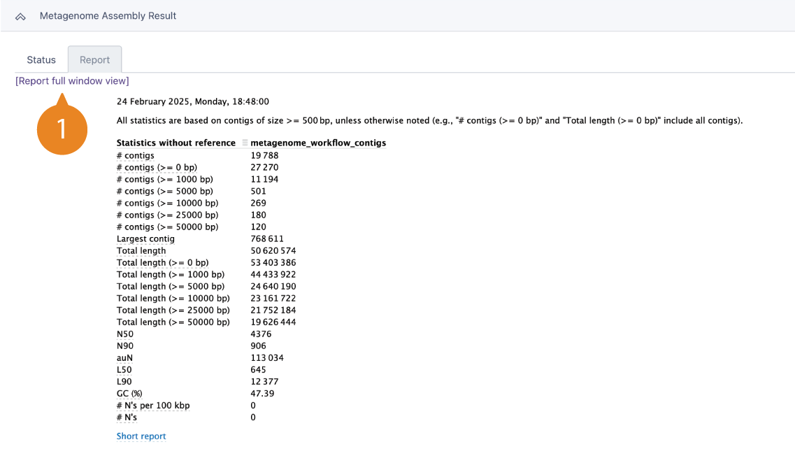 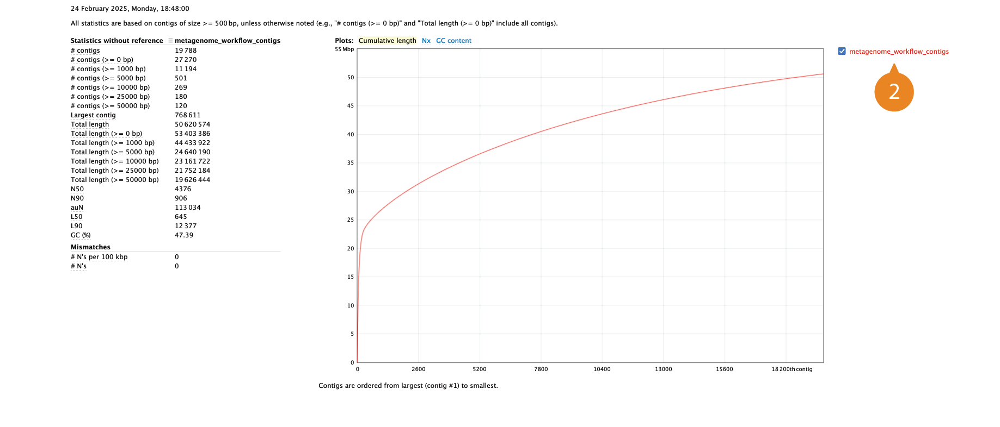
On the next tab, the Report shows contig based statistics and graph of the sizes. The window for the report is expanded in this example to show the full report tab.

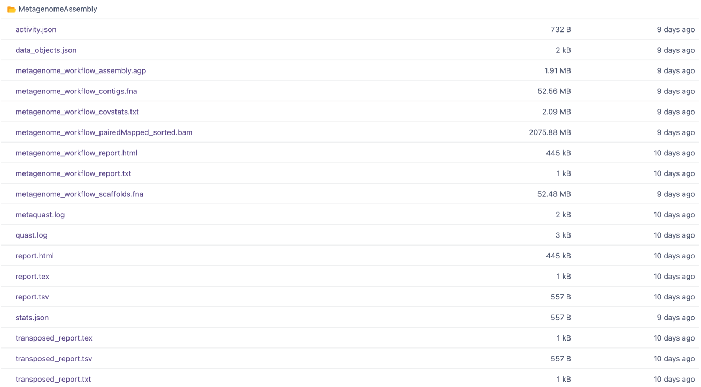

The Download Output section provides output files available to download. The primary result is the `assembly_contigs.fna` file which can also be the input for the Metagenome Annotation workflow. The `pairedMapped_sorted.bam` file along with the assembled contigs file can be the input for the MAGs Generation workflow.

#### Virus and Plasmids

This workflow takes in assembly files (such as `contigs.fasta` or `contigs.fna`) and runs the geNomad workflow, followed by checkV to determine the quality and confidence of the geNomad results. The taxonomy that is reported is based on the [ICTV guidelines](https://ictv.global/vmr). A quickstart guide for geNomad can be found [here](https://portal.nersc.gov/genomad/quickstart.html). This workflow can be run as part of the larger Metagenome workflow or on its own. As part of the larger workflow, Virus and Plasmids is run after Assembly. 

 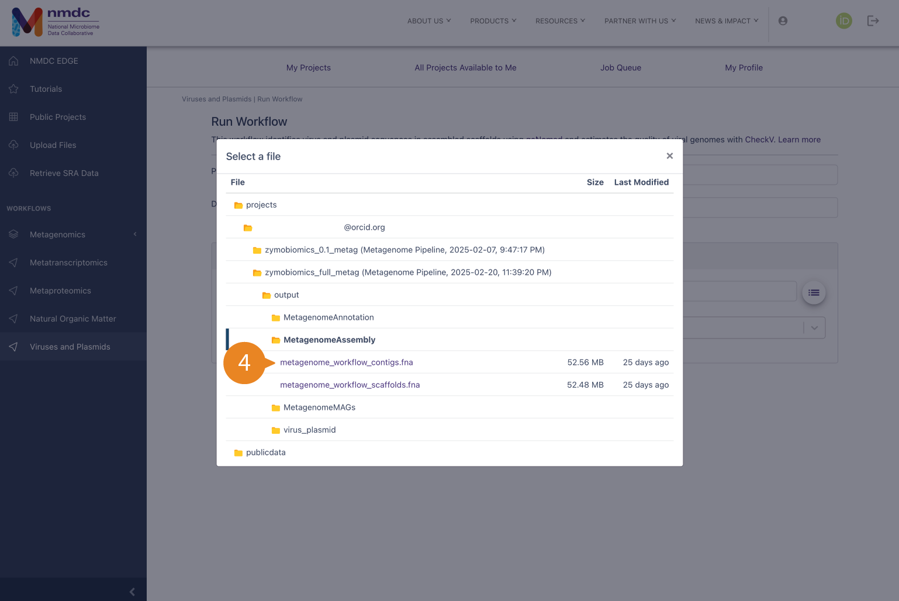

On its own, this workflow has parameter three options when submitting the workflow, show in the opened dropdown box above (Step 5). The following is an explanation of the parameters. 

| Parameter Setting    | Minimum Score | Hallmark Gene Requirement | Additional Notes |
|---------------------|--------------|---------------------------|------------------|
| Default            | 0.7          | At least one for short contigs | - |
| Relaxed           | 0            | No requirement              | Reports all sequences identified as "virus" or "plasmid" regardless of score or annotation |
| Conservative      | 0.8          | At least one for all contigs | - |

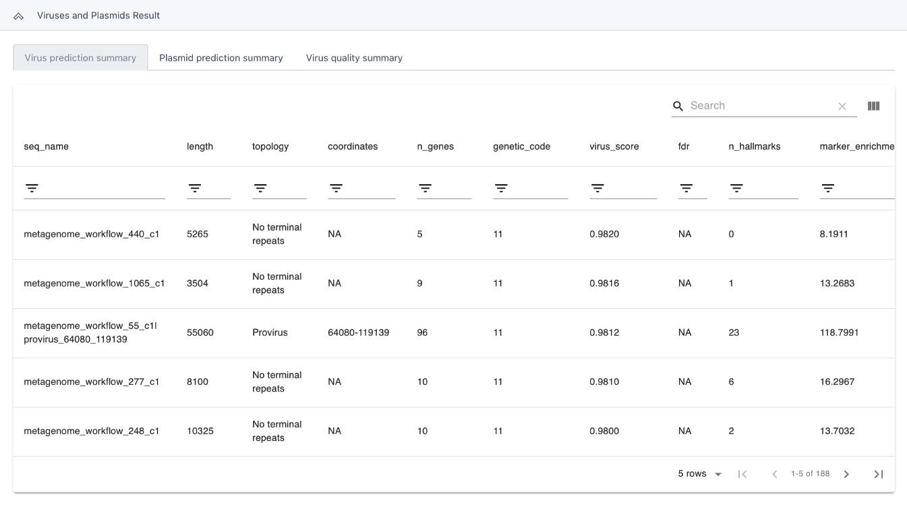

The Result tab displays information about predicted viruses in the input data including sequence length, topology, coordinates, number of genes, genetic code, virus score, false discovery rate (FDR), number of hallmark genes, marker enrichment, and taxonomy. More information about this output data can be found [here](https://portal.nersc.gov/genomad/quickstart.html#understanding-the-outputs).

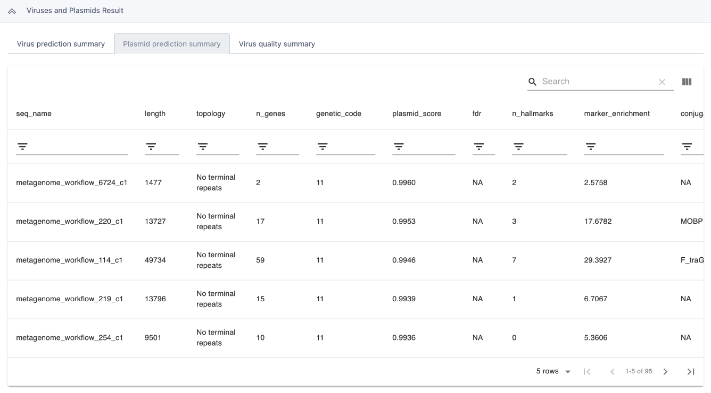

Another table in this section provides the plasmid prediction summary which includes information on sequence length, topology, number of genes, genetic code, plasmid score, false discovery rate (FDR), number of hallmark genes, marker enrichment, conjugation genes, and any antimicrobial resistance (AMR) genes present. As stated above, more information on this output data can be found [here](https://portal.nersc.gov/genomad/quickstart.html).

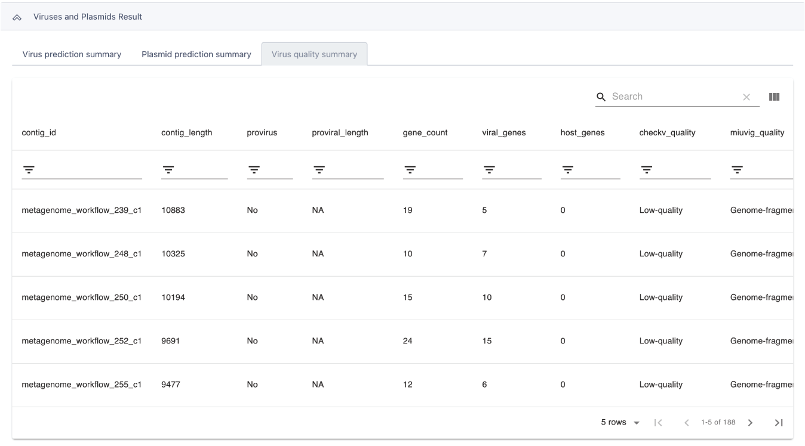

A virus quality summary table is also provided, where it details the contig ID, contig length provirus information, gene counts, quality information, completeness information, completeness method, contamination, k-mer frequency, and any relevant warnings

All output files are available to download under the Browser/Download Outputs tab at the bottom of the results page. However, downloadable results for Virus and Plasmids differ when running on its own versus as part of the full metagenomic pipeline. 

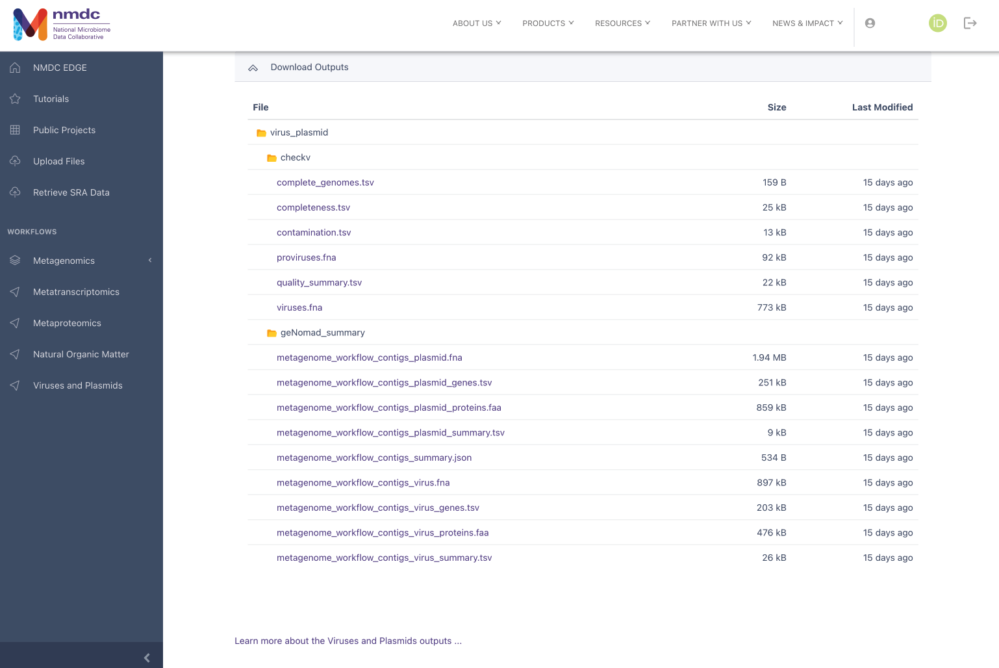

The basic results of the pipeline are CheckV and geNomad output files.

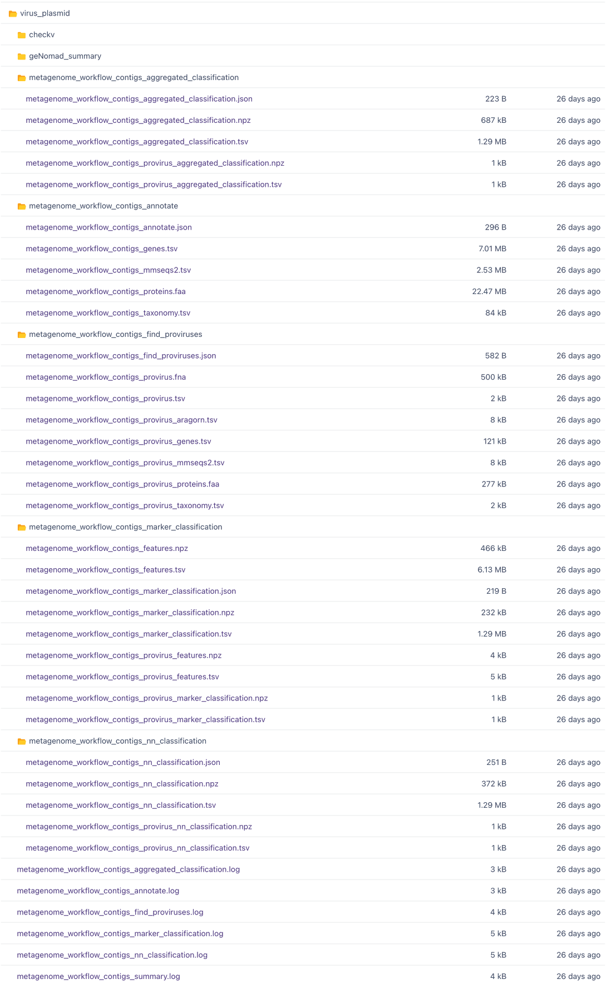

As part of the metagenome pipeline, additional output files consist of more classifications and annotations.

#### Annotation

This workflow takes assembled metagenomes and uses a number of open-source tools and databases to generate the structural and functional annotations. The input assembly is first structurally annotated, then those results are used for the functional annotation.

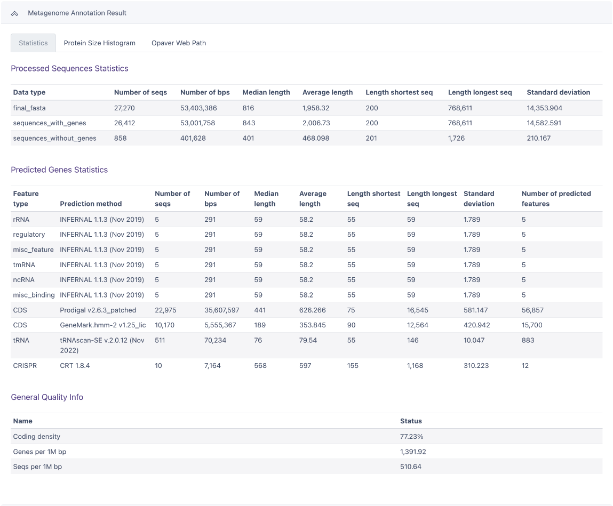

The Metagenome Annotation Result section has statistics for Processed Sequences, Predicted Genes, and General Quality Information from the workflow.

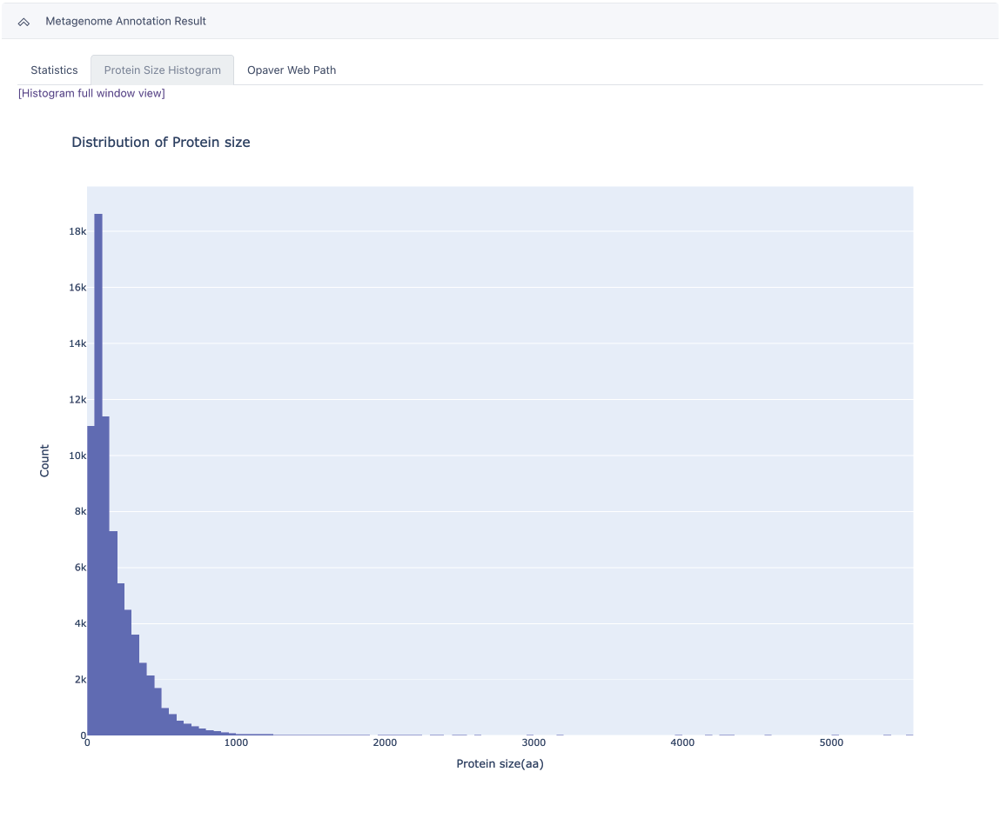

A graph for distribution of protein sizes is also provided in the second tab of the results. 

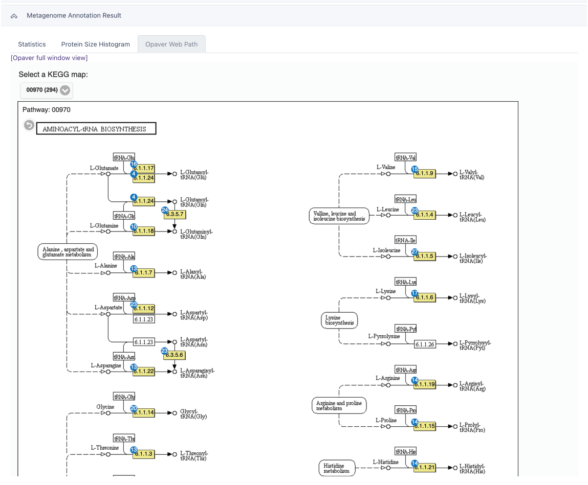

The Opaver Web Path tab offers interactive KEGG maps for further analysis to the pathways detected in the workflow.

The Download Output section provides output files available to download. The primary results are the functional annotation and the structural annotation files (`.gff`). The functional annotation file is required input for the MAGs Generation workflow along with the assembled contigs.

#### MAGs Generation

For all processed metagenomes, it classifies contigs into bins. Next, the bins are refined using the functional Annotation file (GFF) from the Metagenome Annotation workflow and optional contig lineage information. The completeness of and the contamination present in the bins are evaluated bins are assigned a quality level (High Quality (HQ), Medium Quality (MQ), Low Quality (LQ)).

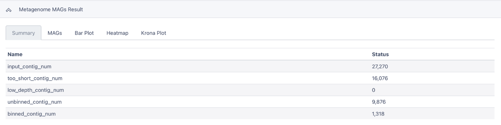

The Metagenome MAGs Result section provides a Summary section with information on binned and unbinned contigs. 

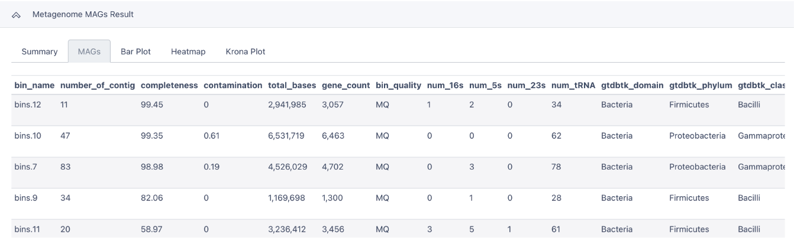

The MAGs section provides information such as the completeness of the genome, amount of contamination, and number of genes present on all bins determined to be high quality or medium quality.

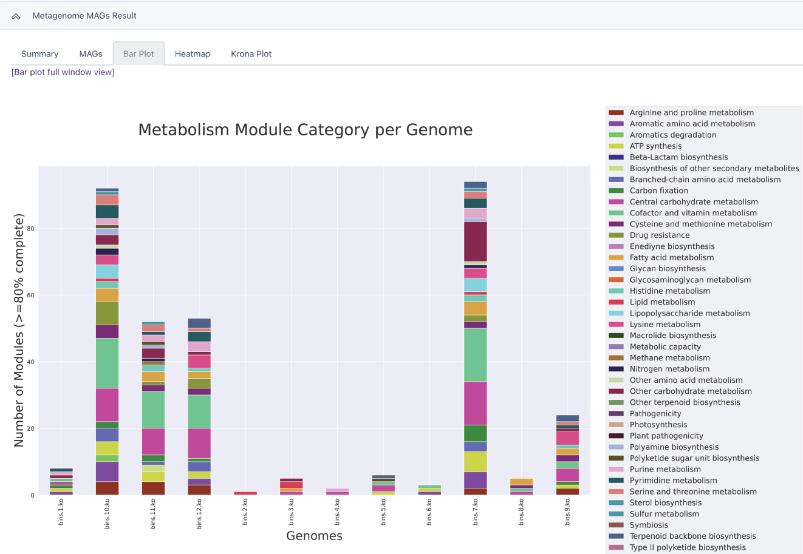

The Bar Plot contains information regarding metabolism module categories per genome, based off the KO analysis results.

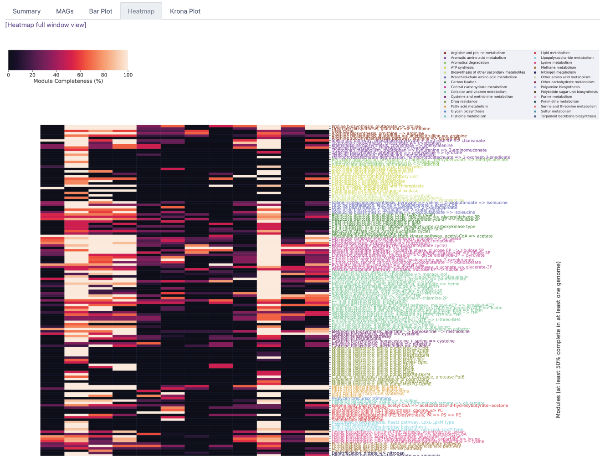

The Heatmap presents the completeness of the modules shows in the bar plot.

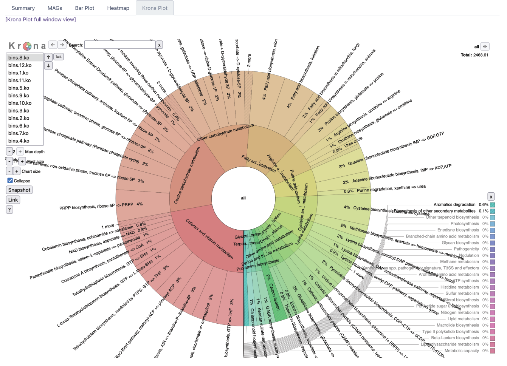

The Krona plot contains the KO analysis results for metagenome bins at two levels of module binning.

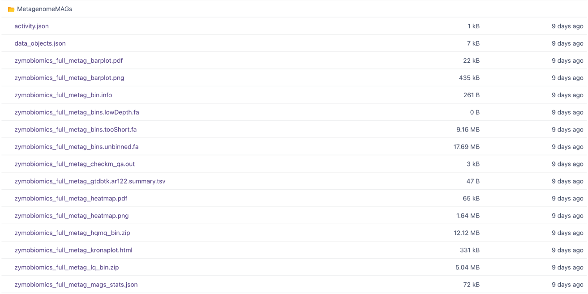

The Download Output section provides output files available to download. The primary output file is the zipped file with all bins determined to be high quality or medium quality (`hqmq.zip`).

