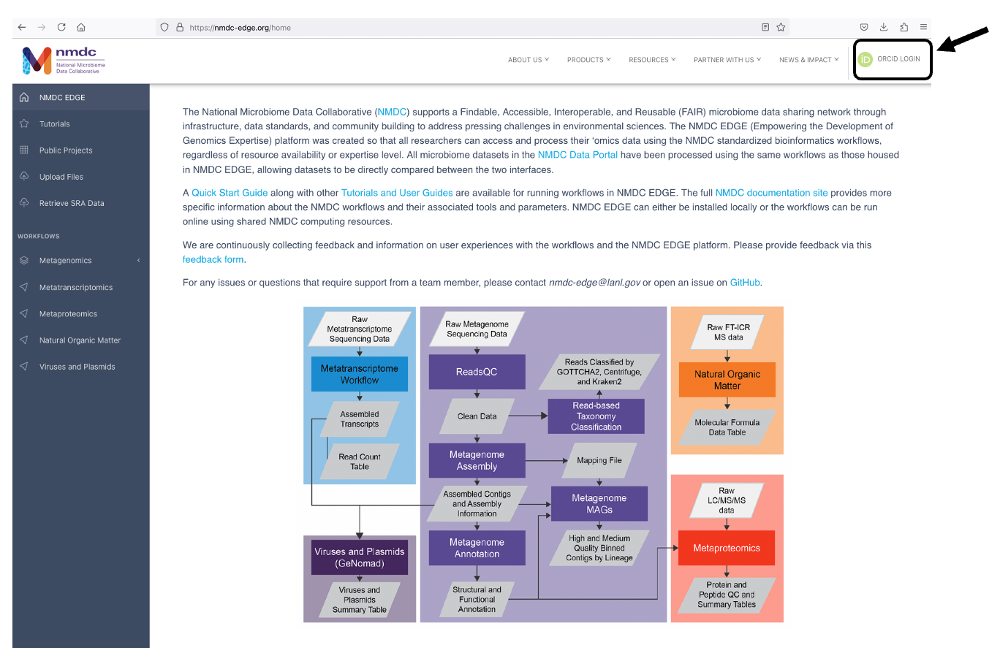
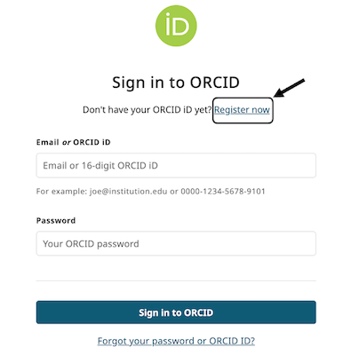
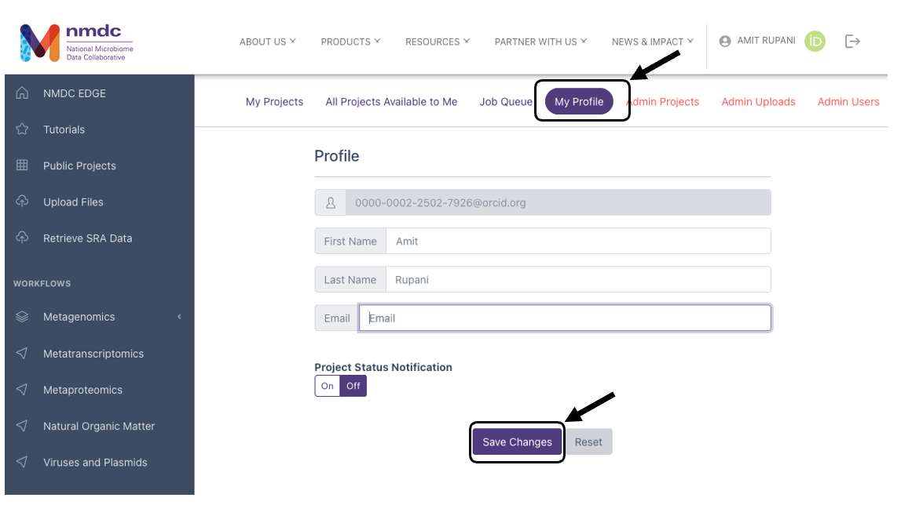
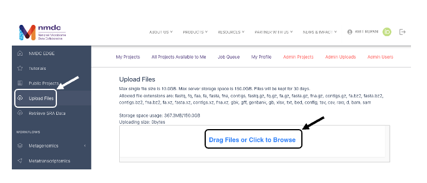
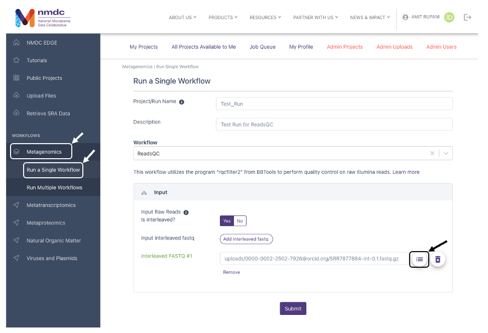
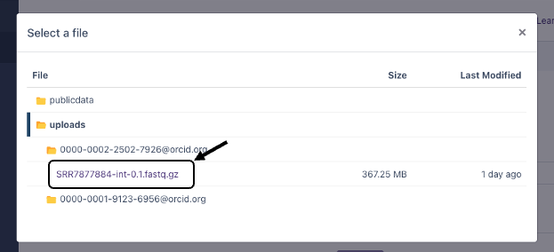
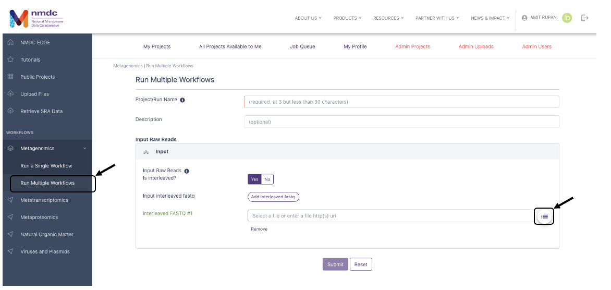
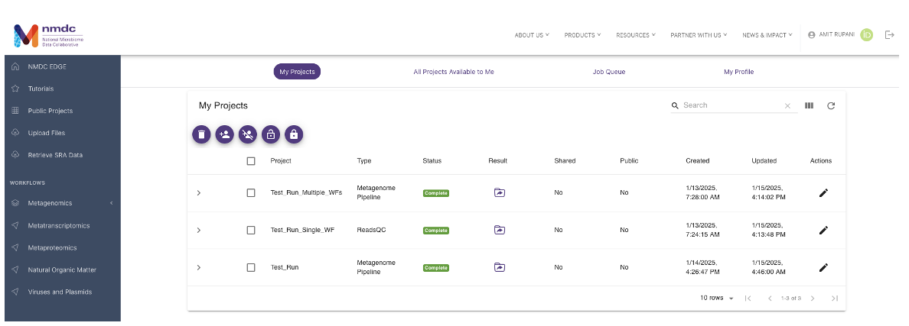

#  Running the Workflows

## NMDC EDGE Quick Start User Guide

### Register for an account

1. Visit the homepage for NMDC EDGE platform using the link below.\
https://nmdc-edge.org/home

2. Click on "ORCiD LOGIN" to login to your account on the NMDC EDGE platform. 

    

3. Login using your ORCiD and ORCiD password. If you do not have an ORCiD, click on "Register Now" and follow the instructions to set-up an ORCiD account.

    

4. If you are logging in for the first time, click on "My Profile" and optionally provide your First Name, Last Name, and Email. You can also set the "Project Status Notification" to ON (OFF by default). If ON, notifications about your workflow runs will be sent to the Email you provided. Click on "Save Changes"

    

### Upload data

You can upload your own data to process through the workflows. Click on "Upload Files" in the left menu bar. This will open a window which allows you to drag and drop files or browse for your data files. If you do not have a dataset to test, you can download this [**test data**](https://portal.nersc.gov/cfs/m3408/test_data/SRR7877884/SRR7877884-int-0.1.fastq.gz) and upload it to the NMDC EDGE platform. 

Additionally, there are some datasets in the Public Data folder for you to test within the NMDC EDGE platform.

Alternatively, you can select "Retrieve SRA Data" in the left menu bar and input an NCBI SRA accession number to pull data directly from SRA. 

### Running a single metagenomics workflow 

Click on "Metagenomics" then select the "Run a Single Workflow" option.

 

To run a single workflow, the user must provide:

1.  A unique Project/Run Name with no spaces (underscores are fine).

2.  A description (optional, but recommended).

3.  The workflow desired from the drop-down menu.

4.  Select if the input data is interleaved (YES by default). If the data is paired select NO and it will allow you to upload both forward and reverse files.

5.  Then select the input file(s). Clicking on the button to the right of the "interleaved FASTQ #1" (as indicated in the image above) opens a box called "Select a file" (as indicated in the image below) to allow the user to find the desired files, either from the public data folder, or files that were uploaded by the user. 

    

6.  Click "Submit" to start a workflow run.

### Running multiple workflows

1.  Another option is to select "Run Multiple Workflows" if you
    desire to run the entire metagenomic pipeline that includes multiple workflows.

2.  Enter a **unique** Project/Run Name with no spaces
    (underscores are fine).

3.  A description (optional, but recommended).

4.  Select if the input data is interleaved (YES by default). If the data is paired select NO and it will allow you to upload both, forward and reverse files.

> 

5.  Then select the input file(s). Clicking on the button to select "interleaved FASTQ #1" opens a box called "Select a file" (as shown in the image below) to allow the user to find the desired files, either from the public data folder, or files uploaded by the user.
    
    
7.  Click "Submit" to start a metagenome workflow run.

### Output 

1.  The link for "My Projects" opens the list of projects for that user

2.  Links (in the purple circles) are provided to share projects, make projects public, or delete projects

3.  The "Status" column shows whether the job is in the queue (gray), submitted (blue), running (yellow), has failed (red) or completed (green). If a project fails, a log will give the error messages for troubleshooting.

4.  Clicking on the icon in the "Result" field opens up the results page for that project. 

> 

### Project Summary (Results)

The project summary page will show three categories. Clicking on the bar or tab opens up the information.

1.  General contains the project run information.

2.  "Workflow" Result contains the tabular/visual output for each of the workflows that were run.

3.  Download Outputs contains all the output files available for downloading. There may be several folders.

> 

This example shows the results of a metagenome workflow run which shows run time under the General tab, the workflow results of each individual metagenome workflow, and the files available for download under the Download Outputs tab.

As a second example, the next two figures show the results from the Read-based Taxonomy Classification workflow. The summary includes classified reads and the number of species identified for all of the selected taxonomy classifiers. A list of the top ten organisms identified by each tool at three taxonomic levels is also provided. Tabs for each of the classification tools providing more in-depth results are in the Detail section. Krona plots are generated for the results at each of the three taxonomic levels for each of the tools and these can also be found in the Detail section. Full results files (beyond the Top 10) and the graphics are available for download in the "Download Outputs" section.

## Metagenomics Workflows
### ReadsQC

#### Overview

This workflow performs quality control on raw Illumina reads to
trim/filter low quality data and to remove artifacts, linkers, adapters,
spike-in reads and reads mapping to several hosts and common microbial
contaminants.

#### Running the Workflow

Currently, this workflow is available in
[GitHub](https://github.com/microbiomedata/ReadsQC) and can be run from
the command line.
Alternatively, this workflow can be run in [NMDC
EDGE](https://nmdc-edge.org/).

#### Running the Reads QC Workflow in NMDC EDGE

Select a workflow

1.  From the Metagenomics tab in the left menu bar, select "Run a
    Single Workflow".

2.  Enter a **unique** project name with no spaces
    (underscores are fine).

3.  A description is optional, but helpful.

4.  Select 'ReadsQC' from the dropdown menu under Workflow.

> 

Input

ReadsQC requires Illumina data in FASTQ format as the input;
the file can be interleaved and can be compressed. **Acceptable file
formats:** .fastq, .fq, .fastq.gz, .fq.gz

5.  The default setting is for the raw data to be in an interleaved
    format (paired reads interleaved into one file). If the raw data is
    paired reads in separate files (forward and reverse), click 'No'.

6.  Additional data files (of the same type--interleaved or separate)
    can be added with the button below.

7.  Click the button to the right of the input blank for data to select
    the data file for the analysis. (If there are separate files, there
    will be two input blanks.) A box called 'Select a File' will open to
    allow the user to find the desired file(s) from previously run
    projects, the public data folder, or files uploaded by the user.

8.  Then click 'Submit'.

> 

Output

The General section of the output shows which workflow was run and the
run time information.

The ReadsQC Result section provides a variety
of metrics including the number of reads and bases before and after
trimming and filtering.

The Download Output section provides output files available to
download. The clean data will be in an interleaved .fq.gz file. General
QC statistics are in the filterStats.txt file.

### Read-based Taxonomy Classification

#### Overview

This workflow takes in Illumina sequencing files (single-end or
paired-end) and profiles the reads using multiple taxonomic
classification tools.

#### Running the Workflow

Currently, this workflow is available in
[GitHub](https://github.com/microbiomedata/ReadbasedAnalysis) and can be
run from the command line.
Alternatively, this workflow can be run in [NMDC
EDGE](https://nmdc-edge.org/).

#### Running the Read-based Taxonomy Classification Workflow in NMDC EDGE

Select a workflow

1.  From the Metagenomics category in the left menu bar, select 'Run a
    Single Workflow'.

2.  Enter a ***unique** project name with no spaces
    (underscores are fine).

3.  A description is optional, but helpful.

4.  Select 'Read-based Taxonomy Classification' from the dropdown menu
    under Workflow.

> 

> 

Input

This workflow accepts Illumina data in FASTQ format as the input; the
file can be interleaved and can be compressed. This input can be the
output from the ReadsQC workflow and this is recommended. **Acceptable
file formats:** .fastq, .fq, .fastq.gz, .fq.gz

5.  The default setting is for the raw data to be in an interleaved
    format (paired reads interleaved into one file). If the raw data is
    paired reads in separate files (forward and reverse), click 'No'.

6.  Additional data files (of the same type--interleaved or separate)
    can be added with the button below.

7.  Click the button to the right of the input blank to select
    the data file for the analysis. (If there are separate files, there
    will be two input blanks.) A box called 'Select a File' will open to
    allow the user to find the desired file(s) from previously run
    projects, the public data folder, or files uploaded by the user.

8.  Then click 'Submit'.

> 

Output

The General section of the output shows which workflow and which tools
were run and the run time information.

The Read-based Taxonomy Classification Result section has a summary
section at the top and results for each tool at three levels of taxonomy
in the Taxonomy Top 10 section. The Detail section has classified reads
results and relative abundance results for each tool at three levels of
taxonomy.

The Detail section also provides an interactive Krona plot for each
tool.

The Download Output section provides output files available to
download. Each tool has a separate folder for the results from that
tool. Full tabular results are in the largest .tsv file and the
interactive Krona plots (.html files) open in a separate browser window.

### Assembly

#### Overview

This workflow takes in Illumina data, runs error correction,
assembly, and assembly validation.

#### Running the Workflow

Currently, this workflow is available in
[GitHub](https://github.com/microbiomedata/metaAssembly) and can be run
from the command line.
Alternatively, this workflow can be run in [NMDC
EDGE](https://nmdc-edge.org/).

#### Details

This workflow takes in paired-end Illumina reads and performs error
correction. Then the corrected reads are assembled using
metaSPAdes. After assembly, the reads are mapped back to the contigs for coverage information.

#### Running the Metagenome Assembly Workflow in NMDC EDGE

Select a workflow

1.  From the Metagenomics category in the left menu bar, select 'Run a
    Single Workflow'.

2.  Enter a **unique** project name with no spaces
    (underscores are fine).

3.  A description is optional, but helpful.

4.  Select 'Metagenome Assembly' from the dropdown menu under Workflow.

> 

Input

This workflow accepts Illumina data in FASTQ format as the input; the
file can be interleaved and can be compressed. (It is highly recommended
to input clean data from the ReadsQC workflow.)

**Acceptable file formats:** .fastq, .fq, .fastq.gz, .fq.gz

5.  The default setting is for the raw data to be in an interleaved
    format (paired reads interleaved into one file). If the raw data is
    paired reads in separate files (forward and reverse), click 'No'.

6.  Additional data files (of the same type--interleaved or separate)
    can be added with the button below.

7.  Click the button to the right of the input blank to select
    the data file for the analysis. (If there are separate files, there
    will be two input blanks.) A box called 'Select a File' will open to
    allow the user to find the desired file(s) from previously run
    projects, the public data folder, or files uploaded by the user.

8.  Then click 'Submit'.

> 

Output

The General section of the output shows which workflow was run and the
run time information.

The Metagenome Assembly Result section has all of the statistics from
the assembly.

The Download Output section provides output files available to
download. The primary result is the assembly_contigs.fna file which can
also be the input for the Metagenome Annotation workflow. The
pairedMapped_sorted.bam file along with the assembled contigs file can
be the input for the MAGs Generation workflow.

### Annotation

#### Overview

This workflow takes assembled metagenomes and generates structural and
functional annotations.

#### Running the Workflow

Currently, this workflow is available in
[GitHub](https://github.com/microbiomedata/mg_annotation/) and can be
run from the command line.
Alternatively, this workflow can be run in [NMDC
EDGE.](https://nmdc-edge.org/)

#### Details

The workflow uses a number of open-source tools and databases to
generate the structural and functional annotations. The input assembly is 
first structurally annotated, then those results
are used for the functional annotation. 

#### Running the Metagenome Annotation Workflow in NMDC EDGE

Select a workflow

1.  From the Metagenomics category in the left menu bar, select 'Run a
    Single Workflow'.

2.  Enter a **unique** project name with no spaces
    (underscores are fine).

3.  A description is optional, but helpful.

4.  Select 'Metagenome Annotation' from the dropdown menu under
    Workflow.

>

Input

This workflow accepts assembled Illumina data in FASTA format as the
input; the file can be compressed. (It is highly recommended to input
the assembled contigs from the Metagenome Assembly workflow.)
**Acceptable file formats:** .fasta, .fa, .fna, .fasta.gz, .fa.gz,
.fna.gz.

5.  Click the button to the right of the input blank to select
    the data file for the analysis. (If there are separate files, there
    will be two input blanks.) A box called 'Select a File' will open to
    allow the user to find the desired file(s) from previously run
    projects, the public data folder, or files uploaded by the user.

6.  Then click 'Submit'.

> 

Output

The General section of the output shows which workflow was run and the
run time information.

The Metagenome Annotation Result section has statistics for Processed
Sequences, Predicted Genes, and General Quality Information from the
workflow.

The Download Output section provides output files available to
download. The primary results are the functional annotation and the
structural annotation files (.gff). The functional annotation file is
required input for the MAGs Generation workflow along with the assembled
contigs. 

### MAGs Generation

#### Overview

This workflow classifies contigs into bins and the resulting bins are
refined using the functional annotation file. The bins are evaluated for
completeness and contamination. The quality of the bins is determined
and a lineage is assigned to each bin of high or medium quality.

#### Running the Workflow

Currently, this workflow is available in
[GitHub](https://github.com/microbiomedata/metaMAGs) and can be run from
the command line.
Alternatively, this workflow can be run in [NMDC
EDGE.](https://nmdc-edge.org/)

#### Details

For all processed metagenomes, it classifies contigs into bins. Next, the
bins are refined using the functional Annotation file (GFF) from the
Metagenome Annotation workflow and optional contig lineage information.
The completeness of and the contamination present in the bins are
evaluated bins are assigned a quality level (High Quality
(HQ), Medium Quality (MQ), Low Quality (LQ)).

#### Running the Metagenome Assembled Genomes (MAGs) Workflow in NMDC EDGE

Select a workflow

1.  From the Metagenomics category in the left menu bar, select 'Run a
    Single Workflow'.

2.  Enter a **unique** project name with no spaces
    (underscores are fine).

3.  A description is optional, but helpful.

4.  Select 'Metagenome MAGs' from the dropdown menu under Workflow.

> 

Input

Metagenome MAGs requires assembled contigs, the read mapping file of
reads to assembled contigs, and a functional annotation file. The
recommended input would be from the NMDC assembly and annotation
workflows. **Acceptable file formats:** assembled contigs (.fasta, .fa,
or .fna); read mapping to assembly (.sam.gz or .bam); functional
annotation (.gff)

5.  Click the button to the right of the blank for the Input Contig File. A
    box called 'Select a File' will open to allow the user to find the
    desired file from a previously run assembly project, the public data
    folder, or a file uploaded by the user.

6.  Click the button to the right of the blank for the Input Sam/Bam File. A
    box called 'Select a File' will open to allow the user to find the
    read mapping file from a previously run assembly project, the public
    data folder, or a file uploaded by the user.

7.  Click the button to the right of the blank for the Input GFF File. A box
    called 'Select a File' will open to allow the user to find the
    desired file(s) from a previously run annotation project, the public
    data folder, or a file uploaded by the user.

8.  Then click 'Submit'.

> 

Output

The General section of the output shows which workflow was run and the
run time information.

The Metagenome MAGs Result section provides a Summary section with
information on binned and unbinned contigs. The MAGs section provides
information such as the completeness of the genome, amount of
contamination, and number of genes present on all bins determined to be
high quality or medium quality.

The Download Output section provides output files available to
download. The primary output file is the zipped file with all bins
determined to be high quality or medium quality (hqmq.zip).

