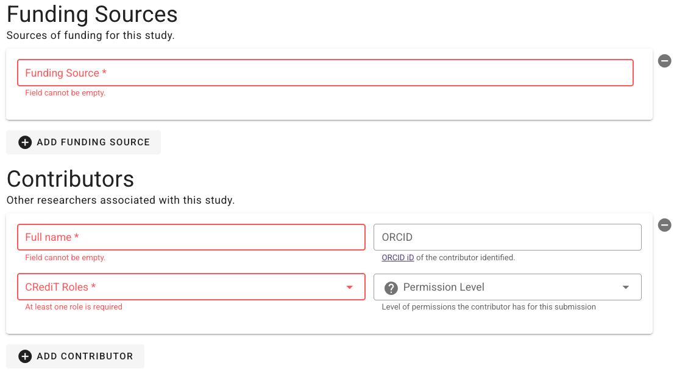
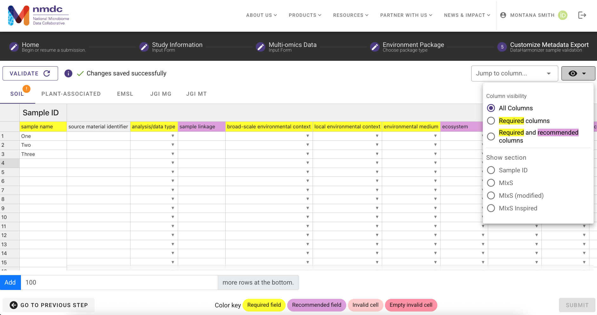
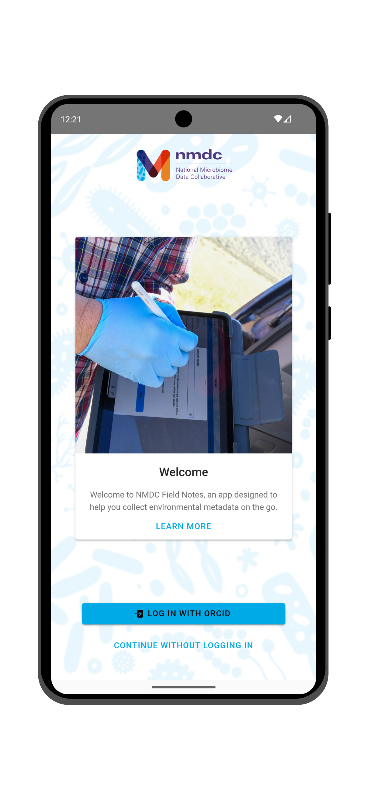
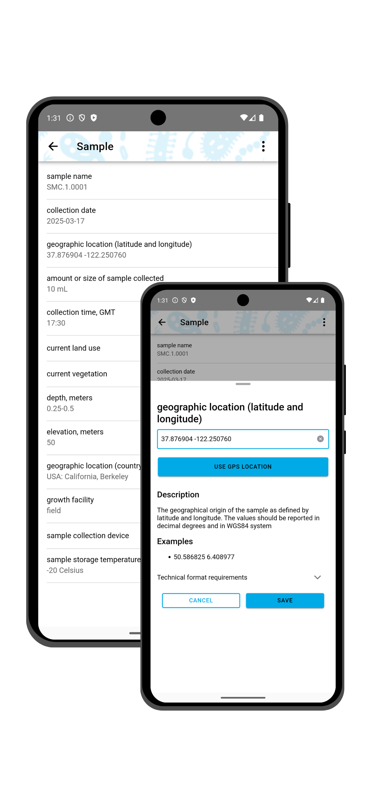

# Submitting to the NMDC

## Introduction: Making metadata capture easy
The NMDC has developed two integrated resources for improving metadata capture: the [NMDC Submission Portal](https://data.microbiomedata.org/submission/home) (released April 2022) and the [NMDC Field Notes](https://microbiomedata.org/field-notes/) mobile app (released April 2025). Each resource was designed to lower barriers to capturing metadata and adhering to community standards, thereby addressing the critical gap of collecting necessary information describing a study, its biosamples, and associated analyses.

### NMDC Submission Portal
The NMDC Submission Portal was designed using a flexible framework leveraging a new modeling approach called the Linked Data Modeling Language (LinkML) and the template-driven spreadsheet tool, [DataHarmonizer](https://github.com/cidgoh/DataHarmonizer). It supports several different community standards, such as the _Minimum Information about any (x) Sequence_ (MIxS) standard from the Genomic Standards Consortium ([GSC](https://www.gensc.org/pages/standards-intro.html)), the _PROV_ standard for provenance metadata, the _Proteomics Standards Initiative_ ([PSI](https://hupo.org/Proteomics-Standards-Initiative-(PSI))) standards for metaproteomics, and the _Metabolomics Standards Initiative_ ([MSI](https://github.com/MSI-Metabolomics-Standards-Initiative/MSIO)) standards for metabolomics. The NMDC Submission Portal is an intuitive interface that allows researchers to provide information about their study, biosample metadata, and multi-omics data generated from the biosamples. For Department of Energy (DOE) researchers, we support data and analysis outputs generated at the Joint Genome Institute (JGI) and the Environmental Molecular Sciences Laboratory (EMSL). Updates and new features are continually being implemented as user research provides new insights to improve usability, and as standards are updated and improved. 

### NMDC Field Notes mobile app

    
    

The NMDC Field Notes mobile app is designed to support real-time registration and collection of standardized metadata and field measurements. This mobile app is built following the same schema format as the Submission Portal and similarly supports the community standards [described above](#nmdc-submission-portal) as well as in [Collaboration to support Community Standards](#collaboration-to-support-community-standards) below. When using the NMDC Field Notes mobile app, metadata can be captured for your samples while in the field using in-app tools and formatting. The NMDC Field Notes mobile app can be used offline and provides a direct connection to the NMDC Submission Portal so your metadata is already there upon field work completion.

#### Connecting NMDC Field Notes and the NMDC Submission Portal
The NMDC Field Notes mobile app synchronizes data with the NMDC Submission Portal and vice versa. This means that changes made in one place will be reflected in the other. Additional details of this synchronization and important considerations are captured in the Field Notes mobile app [documentation and guide](https://github.com/microbiomedata/nmdc-field-notes/blob/main/src/pages/GuidePage/md/guide-page.md).

### Collaboration to support Community Standards 
The Genomic Standards Consortium (GSC) is an open-membership working body formed nearly twenty years ago with the aim of supporting community-driven standards for sequence data. The GSC has defined a set of core descriptors for genomes, metagenomes and the samples thereof, with the intention to capture relevant environmental and other contextual data (e.g., metadata) to be made available in the International Nucleotide Sequence Database Collaboration (INSDC) primary repositories. The Minimum Information about any (x) Sequence (MIxS) was developed in 2011, and forms the basis for environmental packages (now referred to as extensions) that include terms describing specific environments from which a sample was collected (e.g., soil or water). Together with the GSC, the NMDC team has rendered the MIxS standards in LinkML as part of the latest version release. The NMDC has added computability to portions of the MIxS standard and validation can be applied in the NMDC Submission Portal. Through the GSC’s Compliance and Interoperability Group (CIG), the NMDC supports improvements to metadata elements that were unclear or missing, and makes updates to terminology and curation through the insights from numerous workshops hosted through the NMDC Ambassador Program. 

As the NMDC continues to develop and gain user feedback, future iterations of the NMDC Submission Portal and Field Notes mobile app will provide templates for describing the ways in which samples are processed in preparation for analysis and improved ecosystem description. This will be accomplished by leveraging and collaborating with many existing standards and ontologies. Beyond the GSC’s standards, the NMDC leverages standards and controlled vocabularies developed by the Proteomics Standards Initiative (PSI), the [National Cancer Institute’s Proteomic Data Commons](https://pdc.cancer.gov/data-dictionary/dictionary.html), the IUPAC Gold Book, and the Metabolomics Standards Initiative (MSI) for mass spectrometry data types (e.g., ionization mode, mass resolution, scan rate, and so on). The NMDC team also collaborates heavily with the Environment Ontology (EnvO), which is a community-led ontology that represents environmental entities such as biomes, environmental features, and environmental materials.

In addition to working across community standards groups, the NMDC also works closely with the Genomes OnLine Database (GOLD) hosted by the Department of Energy’s Joint Genome Institute (JGI). GOLD is an open-access repository of genome, metagenome, and metatranscriptome sequencing projects with their associated metadata. Samples are described using a curated five-level ecosystem classification path that goes from ecosystem down to the type of environmental material. The NMDC team supports this hierarchical classification system in the Submission Portal, along with enabling search capabilities in the Data Portal. Further, the NMDC and GOLD teams collaborate to curate, update, and make improvements to shared study and metadata information to support interoperability. 

### DataHarmonizer: A flexible template-driven tool
Developed by the Centre for Infectious Disease Genomics and One Health (CIDGOH) at Simon Fraser University, DataHarmonizer is a template-driven spreadsheet application for harmonizing, validating, and transforming sequence contextual data into submission-ready formats for public or private repositories. The tool’s web browser-based JavaScript environment enables real time validation of terms, enabling rapid quality checks within the interface directly. The NMDC has an ongoing open-source collaboration to leverage DataHarmonizer to support the NMDC Submission Portal. 

### User-Centered Design Process
The NMDC is a resource designed together with and for the scientific community. In 2022, the NMDC team conducted three rounds of user interviews (17 user interviews total) from three target groups: general microbiome researchers, potential data submitters, and metadata generators. The Submission Portal has been the subject of several rounds of user research and usability testing, and additional interviews and beta-testing rounds are scheduled to occur throughout the year. New features are continuously added and tested by the microbiome research community, and the NMDC team implements fixes, changes, and enhancements based on this community feedback. The NMDC team and the NMDC Ambassadors run several workshops throughout the year, and feedback from workshop participants is also incorporated into new Submission Portal improvements. The Submission Portal will continue to be shaped by our user-centered design approach.

### Support for DOE User Facilities
The DOE User Facilities, the JGI and EMSL, are key partners for the NMDC because they support the environmental research community. The NMDC team collaborates closely with the JGI and EMSL to support integration of multi-omics data generated across these Facilities, and particularly as part of the Facilities Integrating Collaborations for User Science (FICUS) Program. The Submission Portal has been designed upfront to be compliant with both JGI and EMSL sample submission requirements, ensuring study and biosample information is consistently collected to support interoperability and data reuse. To demonstrate feasibility, several FICUS user projects have been submitted using the Submission Portal with feedback that has informed improvements and new features. Through the Submission Portal, study and biosample metadata is validated against the NMDC schema, with ‘realtime’ checks on data integrity (accuracy, completeness, and consistency). Further developments will also support data embargo information in accordance with the JGI and EMSL Data Policies.

## Resource Access

All NMDC resources are accessible from the "Products" tab on [https://microbiomedata.org/](https://microbiomedata.org/).

NMDC resources require ORCID authentication for full access and functionality.

## Submission Portal Functionality

[https://data.microbiomedata.org/submission/home](https://data.microbiomedata.org/submission/home) 

The Submission Portal requires ORCID authentication to access. If you have already signed in via ORCID iD, you will not see this login screen within the Submission Portal.

Once signed in with an ORCID, you will see an option to ‘Create New Submission’ with subsequent guidance to provide information required for submission to the NMDC. Details about each section are outlined below. Submitters can return to existing submissions saved under the ORCID account to resume their work at any point.   

Creating a 'Test Submission' is available to test and experiment with the NMDC Submission Portal. Test submissions cannot be submitted or changed to a real submission. Any sample metadata entered in a test submission can be exported, and imported into a real submission. See [download and import](#download-and-import) below.

### Study

The Study Information page requires a valid "Study Name" along with a valid email address. We highly recommend the use of standardized, informative study names as described by the GOLD team (Mukherjee et. al., 2023). Further information can be provided to include relevant links to web pages and a description of the study. The "Study Description" should provide a summary that includes the context of your study, research, goals, and design. We recommend this be similar to abstract format, describing the entire study similar to how an abstract describes a single publication.

Studies should also include a funding source and contributors. The "Funding Source" of the research performed under this study should be provided and include an awarding program and the award or grant number. See an [existing study](https://data.microbiomedata.org/details/study/nmdc:sty-11-8fb6t785) for an example.  

A submission's "Contributors" is included to acknowledge members of a research team associated with the study. This includes listing Contributor names, ORCID iDs, associating role(s) based on the CRediT ([Contributor Roles Taxonomy](https://credit.niso.org/)), and their submission access permission. A Contributor can have a single or multiple roles.

Permission roles are granted based on ORCID iD and are as follows:

- Viewer: will have permission to view the entire submission, and cannot make any edits
- Metadata Contributor: will have permission to view the entire submission, and can edit **only** the sample metadata section of the submission
- Editor: will have full view and edit access to all parts of the submission, **except** contributors
- None: no permissions or view granted

The Principal Investigator will be granted the same permissions as the submitter and **can edit the entire submission**.

The last step in the study information is to provide external identifiers for this study. This will ensure any study, project, or sample sets can be linked to your NMDC Study. This information will be used to access the data for NMDC workflows, to share data, and provide valuable connections related to this study. 

### Multi-omics Data

The Multi-omics Data page will prompt submitters to specify what data types have either already been generated or are anticipated to be generated. The NMDC supports the capture of retrospective (data has already been generated) and prospective (data has not yet been generated) metadata capture and data sharing.

To share retrospective data and metadata that was **not** generated at a [DOE User Facility](#support-for-doe-user-facilities), you will be prompted to answer questions about how your -omics data was generated. This provides the information necessary to determine if your data can be analyzed via NMDC workflows. Additional information is typically necessary for mass spectrometry data, so those types have an option to upload protocols (via DOI, url or text) for sample processing, data acquisition and data access methods:

- sample preparation protocol: This protocol should describe how samples were extracted, digested (including which proteolytic enzyme was used), and/or cleaned prior to analysis on an instrument
- data acquisition protocol: This protocol should describe the chromatography and mass spectrometry methods used for data acquisition
- data access methods: Provide the location of the publicly available data

Regardless of these answers, we encourage those interested in sharing their study, metadata, and data to use the NMDC products to capture metadata! 

To share retrospective data and metadata that was generated at a [DOE User Facility](#support-for-doe-user-facilities), similar questions will be asked about what facilities and data types. Extended questions about data generation methods will not be required. 

For retrospective and publically available data, a DOI associated with the data can be entered. A data DOI is not the same as a publication DOI, and would be issued through a separate resource as a unique persistent identifier (e.g., 10.48443/e4zf-b917). 

The NMDC supports metadata capture for sample submission to [DOE User Facility](#support-for-doe-user-facilities) JGI and EMSL. This allows for the capture of metadata for NMDC, JGI, and EMSL in one place. Required information for submitting samples to JGI or EMSL are the user proposal IDs, the type of proposal, and the data that will be generated for the samples being submitted. You will also be prompted to provide your Award DOI (e.g., 10.46936/10.25585/60001289) for the user project. Importantly, these selections will be used to support coordinated submission of biosample information with multiple data types. For example, if a user plans to generate paired metagenome and metaproteome data from aliquots of the same experimental sample, this information will be captured on the subsequent customized metadata template.

**All** submissions to NMDC are kept private and adhere to DOE's data embargo, aligning with user facility data release policies. Submissions are reviewed and once approved the submission will be held until ready for release.

### Sample Environment

The Biosample metadata portion of the Submission Portal uses the GSC’s environmental extensions (previously termed packages) to define data entry screens that are suitable for samples from a particular environment. The available environmental extensions include: air, built environment, host-associated, hydrocarbon resources- core, hydrocarbon resources- fluids swab, microbial material biofilm, plant-associated, sediment, soil, wastewater sludge, water, and miscellaneous natural or artificial environment. Incorporation of additional GSC extensions will be completed upon further user research. A submitter selects the environmental extension(s) that best fit the sample environment(s), with the ability to select a single or multiple extensions as appropriate for the study. The selected extension determines which metadata fields are required, recommended, or optional for each sample type. Additionally, curated EnvO and GOLD ecosystem classification terms and other enumerations that can be selected by dropdown menus are available for some extensions. 

### Sample Metadata

The Sample Metadata interface consists of a grid in which each row represents one sample and each column represents one attribute of a Biosample. Submitters are provided with numerous convenience and organizational features (described below) to assist in metadata completion.

The NMDC uses sections for clarity, and to identify when MIxS specifications have been used as published by the GSC, or when the NMDC team has modified the description, examples, or validation rules for a MIxS attribute captured in their respective columns. These modifications are based on user research and feedback provided to the NMDC.

Biosample metadata can be entered manually (by typing each row), or the data can be entered in bulk by importing a Microsoft Excel XLSX file. The metadata is updated each time a submitter navigates across the submission template, without the need for manually clicking ‘save’. Upon completion, the study submission and metadata will be reviewed by a member of the NMDC team, and once approved, the submitter will indicate when data are ready to be published to the Data Portal.
 
#### Metadata Sections

Detailed biosample metadata input is captured using a curated metadata template. This page allows submitters to input biosample metadata into standardized fields based on the selected environmental template. The biosample metadata fields are split into 4 sections: Sample ID which consists of sample and environmental identification information; MIxS which are fields that are identical to those provided in MIxS templates; MIxS (modified) & MIxS Inspired which are similar to the MIxS fields, but have been altered in some way or were added based on user feedback. 
These updated and additional fields are meant to provide clearer context and expectations for the submitter to better capture information about their samples.

#### Tools and Features 

An information and tools tab can be expanded on the right side of your submission. See [Column Information](#column-information) below.

##### Column Information

Column Information is provided to guide a submitter on the required format and information collected for each metadata term provided here includes a description of the metadata term, additional guidance, and examples of valid completion. 
This column information can also be accessed by double clicking the column header.

##### Find and Replace

When validating the metadata and information provided, the Submission Portal provides a "Find and Replace" tool. This allows bulk updates to invalid metadata.

##### Suggester Tool

This tool provides suggested metadata based on other information provided. It can be triggered or run automatically and suggestions can be accepted individually or in bulk. This tool currently suggests an elevation value, based on the provided latitude and longitude metadata. This tool will be expanded to other metadata fields and the NMDC welcomes your feedback and suggestions. This can be provided via the [We are here to help](#we-are-here-to-help) tab.

##### Download and Import

The NMDC Submission Portal allows submitters to enter sample metadata directly into the web interface. However, if a submitter prefers to work in other applications and programs, such as Microsoft Excel, the NMDC sample metadata template can be downloaded as a .xlsx file, opened via a separate application where submitters can add metadata, and imported back into the Submission Portal for completion and validation. 

##### We are here to help

If you have any issues, need assistance, experience a bug, or have a recommendation for the NMDC, please reach out to us! Our products are built for the research community and at NMDC our goal is to provide useful tools to lower the barriers to data reuse and metadata capture!

##### Show/Hide 

Submitters are encouraged to populate as many of the columns as possible, but not all are required or relevant to all sample types or research. To accommodate such needs, the Biosample Metadata interface distinguishes between required, recommended, and optional columns. Which columns appear on the screen can be controlled with the show/hide menu.  This tool can be used to hide optional or optional + recommended columns, and the show sub-menu can be used to center a particular section on the submitter’s screen.

##### Jump to Column Search 

A ‘Jump to column’ feature is available for searching for specific metadata fields.  The columns in the ‘Jump to column’ menu are listed in the order they appear on the interface when no visibility constraint has been applied. Submitters can either scroll though the listed columns or type in any portion of a column's name. For example, as shown above, submitters can search for the term ‘carbon’ in order to find the ‘carbon/nitrogen ratio’ column. Many slots are available for sample metadata completion, but not all are required or relevant depending on your research questions. The ‘Jump to column’ feature allows the submitter to find the attributes they need and those relevant to their samples.

##### Real Time Validation  

The real-time validation tool allows submitters to check their filled-in metadata and overall progress as they submit values to ensure the submission will be valid and adhere to the NMDC schema. 

##### Color Legend

All fields in the metadata template innately fall into one of three color categories: Grey, Yellow, or Purple. Grey, or no highlighted color, indicates optional fields. Required columns are denoted with yellow. These yellow columns must be correctly completed or the submission will not validate. Recommended fields, highlighted purple, are required where applicable. If any of the purple columns are relevant to the study, they should be completed. For example, if samples are from a moisture manipulation study, the column ‘watering regimen’ should be filled in to provide context and information about the samples. 

After selecting the validate button, cells will become color coded to indicate invalid and incomplete metadata. Dark pink cells indicate a required cell has been left empty. Light pink indicates that there is an error in the formatting of the information entered into that cell. The [Column Information](#column-information) tool, described above, provides expected structure patterns and examples of valid metadata, which you can refer to when addressing validation errors.

## NMDC Field Notes mobile app functionality

[https://microbiomedata.org/field-notes/](https://microbiomedata.org/field-notes/)

The NMDC Field Notes app is for mobile device use. It runs on both Apple (iOS) and Android devices and is available in the corresponding app stores.
This app is designed to streamline real-time registration and collection of standardized metadata and field measurements. 
Upon first use, each section of the app will automatically launch a quick tour. You can press the "→" button to continue the tour or press the "X" button to end it. To re-initialize the tours at any time, visit the Settings page and tap "Reset tours".
The "Guide" section of the app contains recommendations about fieldwork in general, and about collecting metadata for specific sample type(s). It also provides important considerations for synchronization with the Submission Portal. We recommend viewing it before going out into the field.

The NMDC Field Notes mobile app requires ORCID authentication to access it. 
Submissions created in the Field Notes mobile app are available in the Submission Portal. This sync happens automatically when connected to the internet. The app is available for offline use, but requires internet connection to **start** a submission. 

### Welcome to the NMDC Field Notes mobile app! 

Once signed in with an ORCiD, you will have the ability to access existing studies or create a study using the 'New’ button. Details about each section are outlined below. Submitters can also return to existing submissions saved under the ORCiD account to resume their work at any point. 

### New Study

The Study Information page requires a valid "Study Name" and Principal Investigator email address. All other fields are optional and can be completed in the app or in the Submission Portal. Study names and all other information can be updated or added via the app or Submission Portal. See [Study](#study) for more details about Study information.
Also in the New Study you will select the "Environment Template" that best fits your samples. The templates available correspond to the GSC environmental extensions. More information is available [above](#environmental-extension). Multiple environments can be selected and submitted in one submission.

Select "Save" once study information has been completed.

### Select Fields

The Field Notes mobile app allows the submitter to select the metadata fields that will be visible and available on the app and when working in the field. 
Available terms can be selected and de-selected individually or in bulk based on the section they're assigned to. The available sections are: 
- "Common", terms commonly measured at the time of sample collection
- "Occasional", terms that may sometimes be measured at the time of sample collection
- "Uncommon", terms that are rarely measured at the time of sample collection. 
This allows the submitter to tailor their metadata interface to be more focused for field collection.
If you are completing metadata for multiple sample types in multiple templates, you will need to select your fields for each individual template. 
We recommend completing all "New Study" steps prior to and in preparation for field work.

### Samples

In Field Notes, the sample metadata interface consists of a form-like structure where metadata is entered individually, unlike the grid format of the Submission Portal.
Fields marked with a ⚠️ symbol indicate a validation issue. For example, a required value is missing or a value is not in the expected format. These do not prevent your updates from being saved. The issues only need to be resolved before the final submission to the NMDC for review. Once a sample has been started, you can return to the Study page via the ← button in the upper left. Your new sample will now appear at the bottom of your screen.
Additional information about sample metadata can be found above in [Sample Metadata](#sample-metadata). 

#### Tools and Features 

##### Sorting Samples

When samples are added to a study, they are listed at the bottom of the submission. Each sample can be revisited or viewed by selecting the desired sample. Additionally, samples can be filtered based on the sample type / template or you can search for a specific sample.

##### Term Information

Similar to [column information](#column-information) for the Submission Portal, when you select a term to complete metadata, term help will be included below the input field. This provides a description of the term, additional guidance, and examples of valid completion. 

##### Location Provided Metadata

Field Notes can use your mobile device information and location to populate some metadata fields. For example, selecting "Set to today" for the term "collection date" will auto-populate with the current date. Additionally, mobile GPS coordinates can be used to populate the "latitude and longitude" field by selecting "Use GPS location". This along with other auto-populating fields ensure accurate and structured metadata in real time and minimizes human error.

##### Real Time Validation  

Real time validation available in the Field Notes mobile app is similar to that in the Submission Portal [validation](#real-time-validation). No color coding, but the ⚠️ will disappear when metadata is valid, and a note below the input box will provide information if a required field is missing or if a field is misformatted. 
