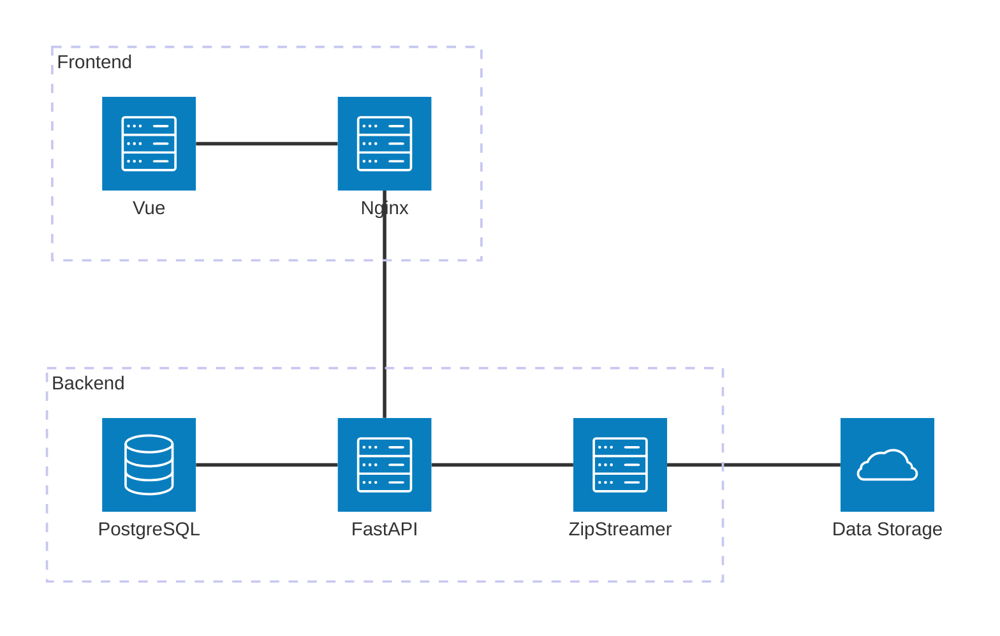

# NMDC Data Portal

The NMDC Data Portal is a web application researchers can use to discover and access standardized multi-omics microbiome data.

The main technologies upon which it is built are:

- [Python](https://www.python.org/) and [FastAPI](https://fastapi.tiangolo.com/)
- [PostgreSQL](https://www.postgresql.org/) and [SQLAlchemy](https://www.sqlalchemy.org/)
- [Vue.js](https://vuejs.org/) and [Vuetify](https://vuetifyjs.com/)

For specific versions of these technologies currently being used by the NMDC Data Portal, see the dependency lists linked below.

## Dependencies

The NMDC Data Portal depends upon various Python and JavaScript packages, which are listed at:

- [Python dependencies](https://github.com/microbiomedata/nmdc-server/blob/main/pyproject.toml)
- [JavaScript dependencies](https://github.com/microbiomedata/nmdc-server/blob/main/web/package.json)

## Architecture

Here's a block diagram depicting the high-level architecture of the NMDC Data Portal.

## Development documentation

Here are some resources people can use to learn about the development of the NMDC Data Portal.

- [Developer guide](https://github.com/microbiomedata/nmdc-server/blob/main/docs/development.md)
- [Frontend developer guide](https://github.com/microbiomedata/nmdc-server/blob/main/web/README.md)
