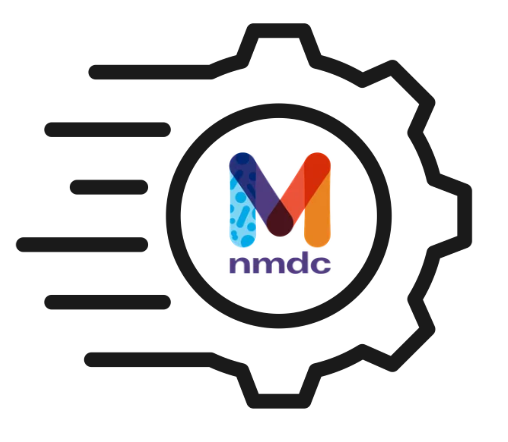

# NMDC Quick Clips

NMDC quick clips are brief tutorials (<5 minutes) that highlight new features, data access, and functionality across the NMDC platform. These tutorials are regularly updated and shared with the research community.

<!--
    Note: Each of the following HTML `iframe` snippets was copied from the "Share > Embed" popup on the video's YouTube page, then, its
          original `width="560" height="315"` attribute pair was replaced with `class="nmdc-embedded-youtube-video"`.  
   -->

1. **Overview of NMDC Notebooks**: The NMDC Notebooks repository provides example Jupyter Notebooks that explore scientific questions to illustrate how to use NMDC’s standardized metadata for multi-omic investigation.
   <iframe class="nmdc-embedded-youtube-video" src="https://www.youtube.com/embed/jEFUTs1iSrI?si=GNEO0x-Rg-GNwDr5" title="YouTube video player" frameborder="0" allow="accelerometer; autoplay; clipboard-write; encrypted-media; gyroscope; picture-in-picture; web-share" referrerpolicy="strict-origin-when-cross-origin" allowfullscreen></iframe>
2. **Text search feature in the Data Portal**: As of the April 2026 release of the Data Portal, users can now search for studies and samples using the free text search box.
   <iframe class="nmdc-embedded-youtube-video" src="https://www.youtube.com/embed/a3zSNugvPZw?si=XvFq3DJSqAEhB1-L" title="YouTube video player" frameborder="0" allow="accelerometer; autoplay; clipboard-write; encrypted-media; gyroscope; picture-in-picture; web-share" referrerpolicy="strict-origin-when-cross-origin" allowfullscreen></iframe>
